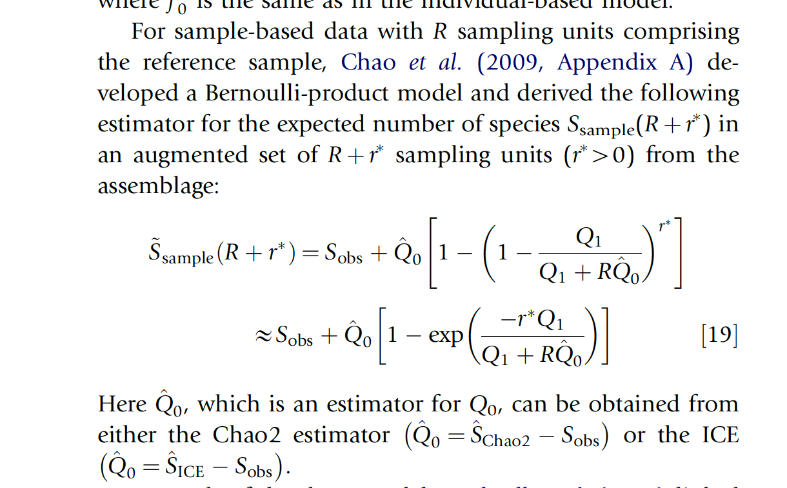

```{r setup, include=FALSE}
knitr::opts_chunk$set(echo = TRUE, error=F, warning=F, message=F, cache=T)
```

# Overview

All code is written in the R the programming language [@R]. This report uses the following R libraries  [@tidyverse;@lmerTest;@testthat;@ggpubr].

```{r}
# Load the libraries
library(tidyverse)
library(lmerTest)
library(testthat)
library(ggpubr)
```

This report is organized as follows:

* First, we describe the data, which consists of two (nested) databases of phonological inventories: UPSID [@Maddieson1984;@MaddiesonPrecoda1990] and PHOIBLE [@MoranMcCloy2019] -- UPSID is included in PHOIBLE.

* Second, we show that both the UPSID and PHOIBLE databases' segment type distributions follow Zipf's law [@Zipf1936;@Zipf1949]. This step helps us to motivate a connection to Herdan-Heaps' law (described next).   

* Third, we evaluate the segment distributions in each database against Herdan-Heaps' law [@Herdan1964;@Heaps1978] (replacing the original standard document count with language count, and word type count with segment type count).

* Fourth, we apply a different estimator of type counts, which we refer to as the Chao-Shen estimator [@ChaoChiu2016], which was developed to estimate the richness of species from limited sample sizes.

* Fifth, we check how each estimator performs when predicting our largest known sample (PHOIBLE) from subsets of languages.

* Sixth, we extrapolate to unseen numbers of languages using both Herdan-Heaps' and the Chao-Shen estimator to estimate how many segment types we might expect in increasingly larger samples of languages.

* Seventh, we compare the results from Herdan-Heaps' and the Chao-Shen estimator and show that the evidence suggests that there is no upper bound to the number segment types (phonemes) we may expect to find. That is, ever increasing linguistic diversity leads to an ever increasing number of phonemes in light of linguistic laws.


# Data

For this study, we use the latest [PHOIBLE data](https://phoible.org) [@MoranMcCloy2019], which includes 3020 phonological inventories from 2186 distinct languages. The dataset is a convenience sample of languages, in which some geographic regions and language families have greater or lesser coverage. Included in PHOIBLE is UPSID-451 [@Maddieson1984;@MaddiesonPrecoda1990], a genealogically balanced sample of languages in which each data point was selected as a representative of its language family. We use both UPSID and PHOIBLE as baselines to evaluate our models. 

We read the PHOIBLE and UPSID data from the [GitHub repository](https://github.com/phoible/dev).

```{r}
#phoible <-  read_csv(url("https://github.com/phoible/dev/blob/646f5e4f64bfefb7868bf4a3b65bcd1da243976a/data/phoible.csv?raw=true"), col_types = c(InventoryID = "i", Marginal = "l", .default = "c"))

phoible = read.csv("./phoible.csv")
```

Our central question concerns how the number of spoken languages that are documented relate to the number of unique phonemes that are observed. This is a question of cumulative growth. It can be rephrased in particulars: 

* "If I have seen *x* languages with *y* unique phonemes, how many unique phonemes do I expect to find in *x* + *i* languages?"

Here is a function to get cumulative segment type counts.

```{r}
# Arguments 
# - df: dataframe of segments (i.e., PHOIBLE or UPSID)
get_cumulative_segment_counts_df <- function(df) {
  results <- numeric()
  encountered <- character()
  for (i in unique(df$InventoryID)) {
    tmp <- df %>% filter(InventoryID == i)
    encountered <- union(encountered, tmp$Phoneme)
    results <- c(results, length(encountered))
  }
  results <- as.data.frame(results)
  results <- results %>% mutate(id = row_number())
  return(results)
}
```

Here is code to randomly sample from PHOIBLE by [ISO 639-3](https://iso639-3.sil.org) code. This step allows us to avoid having multiple inventories for a single language because whereas [Glottocodes](https://glottolog.org/glottolog/glottologinformation) in PHOIBLE provide detail on [doculects](https://phoible.org/faq#inventories-language-codes-doculects-and-sources) [@CysouwGood2013] and ISO 639-3 codes, the latter uniquely identify languages. Language code mappings are available [online](https://github.com/phoible/dev/blob/master/mappings/InventoryID-LanguageCodes.csv).

```{r}
set.seed(1)

nas <- phoible %>%
        distinct(InventoryID, ISO6393) %>%
        filter(is.na(ISO6393)) %>%
        pull(InventoryID)

phoible %>%
  distinct(InventoryID, ISO6393) %>%
  drop_na(ISO6393) %>%
  group_by(ISO6393) %>%
  sample_n(1) %>%
  pull(InventoryID) ->
inventory_ids_sampled_one_per_isocode

inventory_ids_sampled_one_per_isocode <- c(inventory_ids_sampled_one_per_isocode, nas)

phoible %>%
  filter(InventoryID %in% inventory_ids_sampled_one_per_isocode) ->
my_sample
```

Here is code to generate the data for the cumulative segment type data sample.

```{r}
# Extract only the necessary columns
phoible_long <- my_sample %>% select(InventoryID, Phoneme)

# Randomize the order of inventory IDs
set.seed(1)
ids <- unique(phoible_long$InventoryID) %>% sample()

# Reorder the database using the new order of inventory IDs
phoible_long <- phoible_long %>% arrange(match(InventoryID, ids))

# Get the cumulative frequency estimates
phoible_cumulative <- get_cumulative_segment_counts_df(phoible_long)
```

What does it look like for just UPSID-451, which is a genealogically-balanced sample? First we extract just the UPSID inventories.

```{r}
upsid <- phoible %>% filter(Source == "upsid")
expect_equal(length(unique(upsid$InventoryID)), 451)
```

Next we generate the UPSID-451 dataframe for plotting.

```{r}
set.seed(1)

# Extract only the necessary columns
upsid_long <- upsid %>% select(InventoryID, Phoneme)

# Randomize the order of inventory IDs
ids <- unique(upsid_long$InventoryID) %>% sample()

# Reorder the database using the new order of inventory IDs
upsid_long <- upsid_long %>% arrange(match(InventoryID, ids))

# Get the cumulative frequency estimates
upsid_cumulative <- get_cumulative_segment_counts_df(upsid_long)
```

Plot it.

```{r cumulative_plot_upsid}
qplot(id, results, data = upsid_cumulative, xlab="Number of languages (random order)", ylab="Cumulative number of segment types") + theme_bw()
```

Now we plot the full PHOIBLE language sample. Note that the shape is similar, but the x-axis contains many more languages.

```{r, cumulative_plot_phoible}
qplot(id, results, data = phoible_cumulative, xlab="Number of languages (random order)", ylab="Cumulative number of segment types") + theme_bw()
```

The jump in y-axis on both plots is [!Xoo](https://phoible.org/inventories/view/1379), a language reported in UPSID that contains many click consonants unique to this language and not found in any other language in the sample.^[See @Naumann2013 for a reassessment of the number of phonemes in !Xoo.]

We can also plot the estimates against each other. 

```{r, cumulative_plot_phoible_upsid}
# Join the dataframes
pho.and.ups <- bind_rows(phoible_cumulative %>% 
                         mutate(Database = as.factor(rep("phoible", nrow(.)))),
                         upsid_cumulative %>%
                         mutate(Database = as.factor(rep("upsid", nrow(.)))))

ggplot(pho.and.ups, aes(x = id, y = results, color = Database)) +
    geom_point() +
    xlab("Number of languages (random order)") +
    ylab("Cumulative number of segment types") +
    theme_bw() + 
    scale_color_discrete(labels = c("PHOIBLE (OIPL)", "UPSID-451"))
```

It looks like the curve for UPSID is slightly shallower than that for PHOIBLE. The curves appear to diverge exponentially. The more diverse sample -- PHOIBLE -- not only produces higher type counts; it also suggests a generally more pronounced rate of increase. 

Crucially, however, all the curves plotted above resemble Herdan-Heaps' curve -- a function describing the relationship between number of samples and the number of distinct types discovered in those samples. 

Herdan-Heaps' law can be derived from the Mandelbrot distribution (of which Zipf is a special case). As a first step, we test whether the frequency of segments in our databases follows a Zipfian distribution.

# Analyses

## Zipf's law

Some code in this selection is based on the [report](https://rstudio-pubs-static.s3.amazonaws.com/215309_736f5cc00eea4bb9be5a8c566da2beb6.html) by @BastrakovaGarcia2016.

Does the segment distribution in the UPSID-451 and PHOIBLE sample of languages follow [Zipf's law](https://en.wikipedia.org/wiki/Zipf%27s_law)?

First we extract the segments and their frequencies.

```{r}
segments_upsid <- phoible %>%
  filter(Source == "upsid") %>%
  group_by(Phoneme) %>%
  summarize(Frequency = n()) %>%
  arrange(desc(Frequency))

segments_phoible <- phoible %>%
  group_by(Phoneme) %>%
  summarize(Frequency = n()) %>%
  arrange(desc(Frequency))
```

Next we add their rank.

```{r}
segments_upsid$Rank <- 1:nrow(segments_upsid)
segments_phoible$Rank <- 1:nrow(segments_phoible)
```

And we plot the segment type frequency distributions.

```{r}
plot(segments_upsid$Rank, segments_upsid$Frequency, xlab = "Rank", ylab = "Frequency", main = "UPSID-451 segment distribution")
plot(segments_phoible$Rank, segments_phoible$Frequency, xlab = "Rank", ylab = "Frequency", main = "PHOIBLE phoneme distribution")
```

We can also remove all segments with a frequency of one and look more closely at the distribution.

```{r}
segments_gt_1_upsid <- segments_upsid %>% filter(Frequency > 1)
plot(segments_gt_1_upsid$Rank, segments_gt_1_upsid$Frequency, xlab = "Rank", ylab = "Frequency", main = "UPSID segment distribution")

segments_gt_1_phoible <- segments_phoible %>% filter(Frequency > 1)
plot(segments_gt_1_phoible$Rank, segments_gt_1_phoible$Frequency, xlab = "Rank", ylab = "Frequency", main = "PHOIBLE segment distribution")
```

Next we plot log(rank) against log(frequency) and we see that the segment frequency distribution nicely follows Zipf's law.

```{r, zipf_distribution_upsid}
x <- log(segments_gt_1_upsid$Rank)
y <- log(segments_gt_1_upsid$Frequency)
df <- data.frame(x, y)

x_rank <- segments_gt_1_upsid$Rank

plot(x, y, xlab = "Rank (log)", ylab = "Frequency (log)", main = "Zipf's law on UPSID-451")

zipf <- function(rank, a, b, c) {
  return(log(c) + a * log(rank + b))
}

# Choosing the best parameters visually
# lines(x, zipf(x_rank, -1.3, 18, 1000000), col = "green", lwd = 3)

# Estimating the parameters -- TODO have set c lower
fitted <- nls(y ~ zipf(x_rank, a, b, c), data = df, start = list(a = -1.3, b = 18, c = 100000), trace = T)

# Plotting the Zipf's law with the parameters estimated
lines(x, predict(fitted), lty = 1, col = "lightblue", lwd = 4)

Zipfs_coef <- coef(fitted)
```

```{r, zipf_distribution_phoible}
x <- log(segments_gt_1_phoible$Rank)
y <- log(segments_gt_1_phoible$Frequency)
df <- data.frame(x, y)

x_rank <- segments_gt_1_phoible$Rank

plot(x, y, xlab = "Rank (log)", ylab = "Frequency (log)", main = "Zipf's law on PHOIBLE (OIPL)")

zipf <- function(rank, a, b, c) {
  return(log(c) + a * log(rank + b))
}

# Choosing the best parameters visually
# lines(x, zipf(x_rank, -1.3, 18, 1000000), col = "green", lwd = 3)

# Estimating the parameters
fitted <- nls(y ~ zipf(x_rank, a, b, c), data = df, start = list(a = -1.3, b = 18, c = 1000000), trace = T)

# Plotting the Zipf's law with the parameters estimated
lines(x, predict(fitted), lty = 1, col = "lightblue", lwd = 4)

Zipfs_coef <- coef(fitted)
```

The distributions of phonemes reported in both databases are strongly Zipfian.

We now test whether the distribution likewise follows Herdan-Heaps' law. 


## Herdan-Heaps' law

What about the UPSID-451 and PHOIBLE segments and whether their distributions follows [Herdan–Heaps' law](https://en.wikipedia.org/wiki/Heaps%27_law)?

Here is a function to get the cumulative number of segment types versus tokens.

```{r}
# Arguments:
#
# df:   long-form phoneme dataframe 
#       (Inventory ID | Phoneme)
# seed: (optional) set.seed value for random 
#       reshuffling of inventories

get_heaps_df <- function(df, seed = 1) {

  inv <- unique(df$InventoryID)
  
  # Shuffle inventories
  set.seed(seed)
  rand.inv <- sample(inv)
             
  # Reorder the df    
  df <- df %>% arrange(match(InventoryID, rand.inv))
  
  # Get the inventory sizes of each language
  inv.sizes <- df %>%
               group_by(InventoryID) %>%
               summarize(inv.size = n()) %>%
               arrange(match(InventoryID, rand.inv)) %>%
               select(inv.size) %>%
               pull()
  
  # Compute the cumulative sums of the inventory sizes
  cum.tokens <- cumsum(inv.sizes)
  
  # Get the number of unseen (so far) types per inventory
  types <- df %>%
           mutate(index = seq(1, n())) %>%
           mutate(phon.seen = ifelse(index %in% match(unique(Phoneme), Phoneme),
                                     1, 0)) %>%
           group_by(InventoryID) %>%
           summarize(new.types = sum(phon.seen)) %>%
           arrange(match(InventoryID, rand.inv)) %>%
           select(new.types) %>%
           pull()
  
  # Compute the cumulative sum of type counts
  cum.types <- cumsum(types)
  
  # Combine the results
  output <- bind_cols(index = seq(1, length(cum.types)),
                      token_count = cum.tokens,
                      type_count = cum.types)
  
  return(output)
}
```

The equation for Herdan–Heaps' law is: `d = k * n ^B`. In our case `d` is the number of distinct segment types in the sample of languages and `n` is the total number of segment tokens.

```{r}
heaps <- function(K, n, B) {
  K * n^B
}

# Get the total number of observations from PHOIBLE
n <- sum(segments_phoible$Frequency) 

# Settings of K and B based on trial and error -- not the optimal values, but the result is reasonably close to the true value. Therefore, if we do any model tuning, the values we arrive at should be close to these; otherwise, we most likely have a bad fit of Herdan-Heaps' to the data. 
heaps(8, n, .5)
```

An important feature of the Herdan-Heaps' equation is that it can be expressed in the form of a standard linear equation. Simply take the logarithm of each term:

<br><center><span style="font-family:'Times New Roman'">log <i>d</i> = log <i>K</i> + <i>B</i>&sdot; log <i>n</i></span></center></br>

which has the familiar form:

<br><center><span style="font-family:'Times New Roman'"><i>y</i> = <i>&Beta;</i><sub>0</sub> +  <i>&Beta;</i><sub>1</sub> &sdot; <i>x</i></span></center>

The upshot is that we can fit a (log-transformed) linear regression model to the data and: 

- The resulting intercept is the optimal *K* (with some back-transformation: *K* = *e*<sup>*K*</sup>). 

- The coefficient &beta; expresses *B*. 

With these values, we can estimate the type count for any sample size *n* using the standard Herdan-Heaps' equation. 

In the following, we apply this function to PHOIBLE and UPSID in order to estimate the number of phonemes for any sample size of *n* languages. 

First, recall that we have already generated the filtered and sampled long data formats of counts for both UPSID-451 and PHOIBLE.

```{r}
head(upsid_long)
```

Let's get the cumulative counts of the segment types and tokens for several randomized orders of inventories. 

First, a function to randomly permute the order of inventories before collecting the input for the Herdan-Heaps' analysis.

```{r}
rand.heaps.data <- function(df, k){
  data.list <- vector(mode="list", length = k)
  for(i in 1:k){
    curr.data <- get_heaps_df(df, i)
    curr.data$iteration <- as.factor(rep(i, nrow(curr.data)))
    data.list[[i]] <- curr.data
  }
  
  output = do.call(rbind, data.list)
  
  return(output)
}
```

Now apply the function *k* times. Here, we set *k*=10. 

```{r}
heaps_results_upsid <- rand.heaps.data(upsid_long, 10)
heaps_results_phoible <- rand.heaps.data(phoible_long, 10)
```

### UPSID

Now we fit linear regressions for UPSID-451 and PHOIBLE to generate (empirically) optimal values for *B* and *K* (our two free parameters in the Herdan-Heaps' equation).

```{r}
fitHeaps.upsid <- lmer(log(type_count) ~ log(token_count) + (1|iteration), data = heaps_results_upsid)

logK.upsid <- fixef(fitHeaps.upsid)[1]
B.upsid <- fixef(fitHeaps.upsid)[2]
K.upsid <- exp(logK.upsid)

# Get predicted values
hyp.data <- data.frame(token_count = seq(1:nrow(upsid_long)),
                      iteration = rep(1, nrow(upsid_long)))

preds.hyp <- exp(predict(fitHeaps.upsid, hyp.data, re.form=NA))
```

Here we plot the predicted values against the true values.

```{r heaps_upsid}
plot.dat <- bind_cols(hyp.data, Predicted = preds.hyp)

heaps_upsid_p = ggplot(heaps_results_upsid, 
                       aes(x=token_count,
                           y=type_count,
                           color=iteration)) +
                        geom_point(alpha=0.07) +
                        geom_line(data=plot.dat, 
                                  aes(x=token_count,
                                      y=Predicted),
                                  color="black", lwd=1) +
                        ylab("Type count") +
                        xlab("Token count") +
                        theme_bw() +
                        ggtitle("UPSID-451") +
                        theme(legend.position="none",
                              plot.title = element_text(hjust=0.5))

heaps_upsid_p
```

The UPSID model fits quite nicely, suggesting that the distribution follows Herdan-Heaps' law.  


### PHOIBLE (one-inventory-per-language)

Now for PHOIBLE, we begin with the "one-inventory-per-language" version of the database. 

```{r}
fitHeaps.phoible <- lmer(log(type_count) ~ log(token_count) + (1|iteration), data = heaps_results_phoible)

logK.phoible<- fixef(fitHeaps.phoible)[1]
B.phoible <- fixef(fitHeaps.phoible)[2]
K.phoible <- exp(logK.phoible)

# Get predicted values
hyp.data.pho <- data.frame(token_count = seq(1:nrow(phoible_long)),
                      iteration = rep(1, nrow(phoible_long)))

preds.hyp.pho <- exp(predict(fitHeaps.phoible, hyp.data.pho, re.form=NA))
```

And plot the predicted values against the true values.

```{r heaps_phoible_oipl}
plot.dat.pho <- bind_cols(hyp.data.pho, Predicted = preds.hyp.pho)

heaps_phoible_p = ggplot(heaps_results_phoible, 
                       aes(x=token_count,
                           y=type_count,
                           color=iteration)) +
                        geom_point(alpha=.01) +
                        geom_line(data=plot.dat.pho, 
                                  aes(x=token_count,
                                      y=Predicted),
                                  color="black", lwd=1) +
                        ylab("Type count") +
                        xlab("Token count") +
                        theme_bw() +
                        ggtitle("PHOIBLE (OIPL)") +
                        theme(legend.position="none",
                              plot.title = element_text(hjust=0.5))

heaps_phoible_p
```

Again, we find a very nice fit. Even though the observed cumulative distributions of UPSID-451 and PHOIBLE have different shapes, the Herdan-Heaps' equation produces quality predictions for both. 


### PHOIBLE (all)

Let's try the same with the entirety of the PHOIBLE language sample, including multiple inventories for some languages. 

```{r, message=F}
# Get the segment frequencies from full PHOIBLE
freq <- phoible %>%
  group_by(Phoneme) %>%
  summarize(Frequency = n()) %>%
  arrange(desc(Frequency))

num_langs <- nrow(phoible %>% select(InventoryID) %>% distinct())
```

Generate the long-form table.

```{r}
set.seed(1)

# Select the relevant columns
phoible_long_all <- phoible %>% select(InventoryID, Phoneme)

# Randomize the order of inventories
ids <- unique(phoible_long_all$InventoryID) %>% sample()

# Reorder the database according to the new random order
phoible_long_all <- phoible_long_all %>% arrange(match(InventoryID, ids))

# Generate 10 such orderings 
heaps_results_phoible_all <- rand.heaps.data(phoible_long_all, 10)
```

Apply the Herdan-Heaps' model.

```{r}
# Fit the model
fitHeaps.phoible.all <- lmer(log(type_count) ~ log(token_count) + (1|iteration), data = heaps_results_phoible_all)

# Get the values for our parameters
logK.phoible.all <- fixef(fitHeaps.phoible.all)[1]
B.phoible.all <- fixef(fitHeaps.phoible.all)[2]
K.phoible.all <- exp(logK.phoible.all)

# Get predicted values
hyp.data.pho.all <- data.frame(token_count = seq(1:nrow(phoible_long_all)),
                      iteration = rep(1, nrow(phoible_long_all)))

preds.hyp.pho.all <- exp(predict(fitHeaps.phoible.all, hyp.data.pho.all, re.form=NA))
```

Plot the predicted values against the true values.

```{r heaps_phoible_all}
plot.dat.pho.all <- bind_cols(hyp.data.pho.all, Predicted = preds.hyp.pho.all)

heaps_phoible_all_p = ggplot(heaps_results_phoible_all, 
                       aes(x=token_count,
                           y=type_count,
                           color=iteration)) +
                        geom_point(alpha=0.009) +
                        geom_line(data=plot.dat.pho.all, 
                                  aes(x=token_count,
                                      y=Predicted),
                                  color="black", lwd=1) +
                        ylab("Type count") +
                        xlab("Token count") +
                        theme_bw() +
                        ggtitle("PHOIBLE (all)") +
                        theme(legend.position="none",
                              plot.title = element_text(hjust=0.5))

heaps_phoible_all_p
```

This plot replicates the other PHOIBLE-based plot, but on the entire dataset.

### Comparing model parameters across databases

Let's compare the parameter estimates across the databases.

```{r}
params = data.frame(Database = c("UPSID-451",
                                 "PHOIBLE (OIPL)",
                                 "PHOIBLE (all)"),
                    B = c(B.upsid, B.phoible, B.phoible.all),
                    K = (c(K.upsid, K.phoible, K.phoible.all)))

params

```

The values are relatively similar. Interestingly, UPSID-451 and PHOIBLE (all) have nearly identical values for *B*. They differ in the scalar *K*, which explains the sharper increases in values for PHOIBLE. 

If we combine the above plots on the same scale, we get a picture of how these differences in parameters affect the shape of our results.

```{r compare_models_all}
plot.dat.all <- bind_rows(plot.dat %>% 
                            mutate(Source = "UPSID-451"), 
                          plot.dat.pho %>% 
                            mutate(Source = "PHOIBLE (OIPL)"), 
                          plot.dat.pho.all %>% 
                            mutate(Source = "PHOIBLE (all)"))

heaps_comp_p = ggplot(data=plot.dat.all, 
                       aes(x=token_count,
                           y=Predicted, 
                           color=Source)) +
                        geom_line(lwd=0.8) +
                        ylab("Type count") +
                        xlab("Token count") +
                        theme_bw()

heaps_comp_p
```

The PHOIBLE estimates behave unsurprisingly similarly. The growth curve for UPSID-451 is again shallower; however, it does not appear to be too far off. 

Now only plotting OIPL vs. UPSID-451 (for the manuscript)

```{r compare_models}
plot.dat.oipl <- plot.dat.all %>%
                 filter(Source != "PHOIBLE (all)")

heaps_comp_oipl = ggplot(data=plot.dat.oipl, 
                       aes(x=token_count,
                           y=Predicted, 
                           color=Source)) +
                        geom_line(lwd=0.8) +
                        ylab("Type count") +
                        xlab("Token count") +
                        theme_bw()

heaps_comp_oipl
```

We now explore an alternative, generally more flexible estimator of type counts: the Chao-Shen estimator [@Chao_etal2009;@ChaoChiu2016]. If the results converge, then we have some foundation for trusting extrapolated values. 


## The Chao-Shen estimator

The central equation for the Chao-Shen estimator is given below [@Chao_etal2009]. The central parameter for extrapolation is *r*, which expresses the number of additional "sampling units" (in our case, languages) we expect to encounter. 



The Chao-Shen estimator takes an **incidence matrix** as input. An incidence matrix is a record of the presence of absence of some type of thing in each of a set of sampling units. Imagine that you are looking to estimate the number of types of beetles in a forest. You set up a number of traps around the forest to get a (hopefully) representative sample of the overall ecosystem. The traps are the sampling units. The species of beetles are the types. You visit each trap, and for each species of beetle you find there, you record a 1 for that species in that trap. 

The same logic can be applied to languages and phonemes. Languages are our beetle traps and phonemes are the beetles. For each sound out of all known sounds, we record a 1 if it occurs in a given language and a 0 otherwise. Here is an incidence matrix for an invented dataset consisting of 150 total observations of <i>S</i><sub>obs</sub> phonemes from *R* languages:

*Example incidence matrix for invented dataset*

|Phoneme|Lang<sub>1</sub>|Lang<sub>2</sub>|&middot;&middot;&middot;|Lang<sub>*R*</sub>|&sum;<sub>phoneme</sub>|
|:---:|---|---|:---:|---|---|
|**Phon<sub>1</sub>**|1|0|&middot;&middot;&middot;|0|1|
|**Phon<sub>2</sub>**|0|1|&middot;&middot;&middot;|1|2|
|&middot;&middot;&middot;|&middot;&middot;&middot;|&middot;&middot;&middot;|&middot;&middot;&middot;|&middot;&middot;&middot;|&middot;&middot;&middot;|
|**Phon<sub>*S*<sub>obs</sub></sub>**|1|1|&middot;&middot;&middot;|1|30|
|**&sum;<sub>language</sub>**|15|23|&middot;&middot;&middot;|6|150|

- ***R*** is the number of sampling units, in this case the number of languages in our sample. 
- ***S*<sub>obs</sub>** is the number of types that *have* been observed (i.e., the number of sounds which were observed in at least one language).
- **&sum;<sub>language</sub>** is the phonological inventory size per language.
- **&sum;<sub>phoneme</sub>** is the frequency of occurrence of the sounds across languages.

Note that Phon<sub>1</sub> appears only once in the sample; it is a **singleton**. The total number singleton phonemes is ***Q*<sub>1</sub>**. Similarly, Phon<sub>2</sub> appears only twice; it is a **duplicate** (in the terminology of Gotelli and Chao, 2013). The total number of duplicate phonemes is ***Q*<sub>2</sub>**.

@GotelliChao2013 functions coded in R by Nicholas Lester:

```{r}
# args (hold the same for both equations)
# - vector = frequency vector, cells = PHOIBLE frequency of a sound
# - R = number of sampling sites (i.e., # of languages in the sample)
# - r = number of hypothetical additional sampling sites (languages)

# Function to get extrapolated estimates of types
Extrapolate <- function(vector, R, r) {
  Sest <- S_Chao2(vector, R)
  Sobs <- sum(vector > 0)
  Q1 <- sum(vector == 1)
  Q0 <- Sest - Sobs
  if (Q0 > 0) {
    return(Sobs + Q0 * (1.0 - (1.0 - Q1 / (Q1 + R * Q0))**r))
  }
  else {
    return(Sobs)
  }
}

# Function to estimate the number of unseen types from a proposed assemblage (used to compute our estimate of Q0)
S_Chao2 <- function(vector, R) {
  fd <- vector[vector > 0]
  Q1 <- sum(vector == 1)
  Q2 <- sum(vector == 2)
  Sobs <- length(fd)
  if (Q2 > 0.0) {
    res <- Sobs + ((R - 1.0) / R) * ((Q1**2.0) / (2.0 * Q2))
  }
  else {
    res <- Sobs + ((R - 1.0) / R) * Q1 * (Q1 - 1) / 2.0
  }
  return(res)
}
```

The *vector* argument should be a vector of frequencies (in this case, a vector of the frequencies of phonemes, where each cell represents the frequency of an individual phoneme in PHOIBLE). Note that this amounts to the row-wise sums of the incidence matrices described above. *R* is the number of languages in the sample. *r* is a free parameter. It refers to the number of additional **hypothetical** draws that we want to allow our estimator. The output is the expected number of types in the (fake) larger sample. 

### Relationship between Chao-Shen estimates and *r*

Here we examine how the Chao-Shen estimate grows in response to increase in *r* by:

- Picking a number of inventories.
- Computing the frequency vector.
- Computing R.
- Computing r.

Here is a function to predict type count based on iterative increases of the number of observed languages *s*, where this process is repeated *k* times. 

```{r, message=F}
# Arguments
#
# df:       long-form database (e.g., ny_sample)
# r:        how many additional languages to observe 
# k:        how many times to shuffle and the data and perform
#           the iterative estimates
# step:     how many languages to sample at a time
iterative.chao.estimator <- function(df, r, k, step){
  # vector of the unique inventories in the sample
  invs <- unique(df$InventoryID)
  # number of unique inventories in the sample
  num.invs <- length(invs)
  # list to store iterations
  iter.list <- vector(mode="list", length = k)
  # Iterate the process k times
  for(i in 1:k){
    set.seed(i)
    # randomly reorder the inventories
    rand.inds <- sample(invs)
    # reorder the dataframe by the inventories
    df <- df %>%
          arrange(match(InventoryID, rand.inds))
    # The target inventory sizes (what we want estimates for)
    target.sizes <- c(seq(1, num.invs, step), num.invs) 
    # Vector to store the Chao estimates
    iter.chao <- vector(length = length(target.sizes))
    # Vector to store Rs
    Rs <- vector(length = length(target.sizes))
    # Vector to store the total number of 
    # observations (i.e., n from the Herdan-Heaps equation)
    num.obs <- vector(length = length(target.sizes))
    # Vector to store the number of observed types
    num.typ.obs <- vector(length = length(target.sizes))
    # for each target size of languages to estimate
    # type counts for... (note that we can only go
    # to num.invs - r languages to generate estimates
    # in order to get a true baseline).
    for(j in 1:length(target.sizes)){
      # Get R
      R <- target.sizes[j]
      # Get the inventories to use as basis for estimate
      basis.invs <- rand.inds[1:R]
      obs.invs <- rand.inds[1:(R+r)]
      vec <- df %>%
             filter(InventoryID %in% basis.invs) %>%
             group_by(Phoneme) %>%
             summarize(frequency = n(), .groups = 'drop')
      obs.typs <- df %>%
                  filter(InventoryID %in% obs.invs) %>%
                  select(Phoneme) %>%
                  distinct() %>%
                  summarize(type_count = n(), .groups = 'drop') %>%
                  pull()
      num.obs[j] <- sum(vec$frequency)
      num.typ.obs[j] <- obs.typs
      iter.chao[j]  <- Extrapolate(vec$frequency, R, r)
      Rs[j] <- R
    }
    chao.data <- bind_cols(Estimate = iter.chao, 
                            Sample.Size = Rs, 
                            Obs.Size = num.obs,
                            True.Type.Count = num.typ.obs,
                            Iteration = i,
                            r = r)
    
    diffs <- ifelse((chao.data$Sample.Size + chao.data$r) < num.invs,
                    chao.data$Estimate - chao.data$True.Type.Count,
                    NA)
    
    chao.data$Difference <- diffs
    
    chao.data$Iteration <- as.factor(chao.data$Iteration)
    
    iter.list[[i]] <- chao.data
  }
  output <- do.call(rbind, iter.list)
  
  return(output)
}

chao.data.10.10 <- iterative.chao.estimator(my_sample, 10, 10, 10)
chao.data.50.10 <- iterative.chao.estimator(my_sample, 50, 10, 10)
chao.data.100.10 <- iterative.chao.estimator(my_sample, 100, 10, 10)
chao.data.500.10 <- iterative.chao.estimator(my_sample, 500, 10, 10)
chao.data.1000.10 <- iterative.chao.estimator(my_sample, 1000, 10, 10)
chao.data.1500.10 <- iterative.chao.estimator(my_sample, 1500, 10, 10)
chao.data.2000.10 <- iterative.chao.estimator(my_sample, 2000, 10, 10)

```

Next we plot the results.

First, we get mean estimates of (a) number of observations, (b) estimated type count, and (c) mean difference (where available) between estimated and observed type count.

```{r}
# function to generate mean estimates, etc.
# Arguments
#
# df:   dataframe of estimates Chao-Shen values (output of 
#       iterative.chao.estimator())
mean.obs.fnc <- function(df){
  new.df <- df %>%
            group_by(Sample.Size) %>%
            summarize(mean.typ = mean(True.Type.Count),
                      mean.est = mean(Estimate),
                      mean.diff = mean(Difference, na.rm=T),
                      mean.obs = mean(Obs.Size),
                      r = r) %>%
            distinct()
  
  return(new.df)

}

# Get means for each of the sizes of r
mean.obs.df.10 <- mean.obs.fnc(chao.data.10.10) 
mean.obs.df.50 <- mean.obs.fnc(chao.data.50.10) 
mean.obs.df.100 <- mean.obs.fnc(chao.data.100.10) 
mean.obs.df.500 <- mean.obs.fnc(chao.data.500.10) 
mean.obs.df.1000 <- mean.obs.fnc(chao.data.1000.10) 
mean.obs.df.1500 <- mean.obs.fnc(chao.data.1500.10) 
mean.obs.df.2000 <- mean.obs.fnc(chao.data.2000.10) 
```

Next the plots.

```{r}
# Function to plot the iterative Chao-Shen estimates
# Arguments
#
# chao.df:    dataframe containing iterative Chao-Shen estimates
#             (output of iterative.chao.estimator())
# mean.df:    dataframe with mean estimates of Chao-Shen
#             across iterations
# title:      plot title

choa.iter.plotter <- function(choa.df, mean.df, title){
  p <- ggplot(choa.df, aes(x=Sample.Size, 
                           y=Estimate, 
                           color=Iteration)) +
                  geom_line() +
                  scale_color_manual(values = rep("grey70", 10)) + 
                  geom_line(data = na.omit(mean.df), aes(y=mean.typ, 
                                                x=Sample.Size), 
                            col="red", lwd=1) +
                  geom_line(data = mean.df, aes(y=mean.est, 
                                                x=Sample.Size),
                            col="dodgerblue", lwd=1) +
                  ylab("Estimated number of types") + 
                  xlab("Number of languages") +
                  theme_bw() +
                  ggtitle(title) +
                  theme(legend.position="none",
                        plot.title = element_text(hjust=0.5))
  
  return(p)

}

# r = 10
chao.iter.plot.10 <- choa.iter.plotter(chao.data.10.10, mean.obs.df.10, "r = 10") + ylim(0,4000)

chao.iter.plot.10

# r = 50
chao.iter.plot.50 <- choa.iter.plotter(chao.data.50.10, mean.obs.df.50, "r = 50") + ylim(0,4000)

chao.iter.plot.50

# r = 100
chao.iter.plot.100 <- choa.iter.plotter(chao.data.100.10, mean.obs.df.100, "r = 100") + ylim(0,4000)

chao.iter.plot.100

# r = 500
chao.iter.plot.500 <- choa.iter.plotter(chao.data.500.10, mean.obs.df.500, "r = 500") + ylim(0,4000)

chao.iter.plot.500

# r = 1000
chao.iter.plot.1000 <- choa.iter.plotter(chao.data.1000.10, mean.obs.df.1000, "r = 1000") + ylim(0,4000)

chao.iter.plot.1000

# r = 1500
chao.iter.plot.1500 <- choa.iter.plotter(chao.data.1500.10, mean.obs.df.1500, "r = 1500") + ylim(0,4000)

chao.iter.plot.1500

# r = 2000
chao.iter.plot.2000 <- choa.iter.plotter(chao.data.2000.10, mean.obs.df.2000, "r = 2000") + ylim(0,4000)
chao.iter.plot.2000
```

```{r, chao_lang_types}
increm.chao.plots <- ggarrange(chao.iter.plot.10 +
                                 ylab("") +
                                 xlab(element_blank()),
                               chao.iter.plot.50 + 
                                 ylab("") +
                                 xlab(element_blank()),
                               chao.iter.plot.100 + 
                                 ylab("") +
                                 xlab(element_blank()),
                               chao.iter.plot.500 +
                                 ylab("") +
                                 xlab(element_blank()),
                               chao.iter.plot.1000 + 
                                 ylab("") + 
                                 xlab(element_blank()), 
                               chao.iter.plot.1500 + 
                                 ylab("") + 
                                 xlab(element_blank()),
                               chao.iter.plot.2000 +
                                 ylab("") + 
                                 xlab(element_blank()), 
                               ncol=3,
                               nrow=3)

annotate_figure(increm.chao.plots, bottom = "Number of languages (R)", left = "Estimated number of types")
```

In the above plots, the red lines represent the mean of the true number of observed types per number of languages *R*, across iterations. The blue lines represent the same taken over the Chao-Shen estimates. Grey lines represent the actual Chao-Shen estimates for each iteration. The panels reflect the different values of *r* tested here.

(Note that the red lines become shorter as *r* increases; this is because we have fewer true values to compare against when we look further ahead per calculation).

The results are highly consistent, with near-perfect prediction for lower values of *r*.  Moreover, the variability in the estimates remains stable across lower sample sizes, but decreases gradually as the ratio of *R* to *r* increases. The most stable estimates for these sample sizes begin to surface around 1000 languages. This appears to be consistent across values of *r*.

As *r* increases (holding *R* constant), so does the degree of underestimation.  This discrepancy appears as the increasing difference between red and blue lines as *r* increases, particularly for smaller values of *R*.

Unfortunately, we are constrained by the sample size. Our true values of *r* will be much larger than those we are able to examine empirically (at least twice what our highest value is here).

But if we look carefully (and do some imaginative extrapolation), it looks like sample sizes of ~1000 languages show very close estimates even as *r* increases. Put another way, after 1000 languages, increases in *r* affect the degree of underestimation less. 

We can also plot the proximity of the estimates to the true values by substituting the difference between estimated and observed values. 

### Plotting error of Chao-Shen estimates in PHOIBLE

```{r}
# Function to plot differences between estimated and true values
#
# Arguments
# - df:       output of iterative.chao.estimator()
# - mean.df:  output of mean.obs.fnc()
# - title:    (string) title for the plot
diff.plotter <- function(df, mean.df, title){
    p <- ggplot(df, 
                aes(x=Sample.Size, 
                    y=Difference, 
                    color=Iteration)) +
                geom_line() +
                geom_line(data=mean.df,
                          aes(x=Sample.Size,
                              y=mean.diff),
                              col="dodgerblue",
                              lwd=0.9) +
                ylab("Difference in type counts (Est. - Obs)") + 
                xlab("Number of languages") +
                theme_bw() +
                ggtitle(title) +
                scale_color_manual(values = rep("grey80", 10)) + 
                theme(legend.position="none",
                      plot.title = element_text(hjust=0.5))
                
    return(p)
}

chao.iter.diff.plot.10 <- diff.plotter(chao.data.10.10, mean.obs.df.10, "r=10") + ylim(-2500, 400)

chao.iter.diff.plot.10

chao.iter.diff.plot.50 <- diff.plotter(chao.data.50.10, mean.obs.df.50,"r=50") + ylim(-2500, 400)

chao.iter.diff.plot.50

chao.iter.diff.plot.100 <- diff.plotter(chao.data.100.10, mean.obs.df.100,"r=100") + ylim(-2500, 400)

chao.iter.diff.plot.100

chao.iter.diff.plot.500 <- diff.plotter(chao.data.500.10, mean.obs.df.500,"r=500") + ylim(-2500, 400)

chao.iter.diff.plot.500

chao.iter.diff.plot.1000 <- diff.plotter(chao.data.1000.10, mean.obs.df.1000,"r=1000") + ylim(-2500, 400)

chao.iter.diff.plot.1000

chao.iter.diff.plot.1500 <- diff.plotter(chao.data.1500.10, mean.obs.df.1500,"r=1500") + ylim(-2500, 400)

chao.iter.diff.plot.1500

chao.iter.diff.plot.2000 <- diff.plotter(chao.data.2000.10, mean.obs.df.2000,"r=2000")

chao.iter.diff.plot.2000
```


```{r, chao_error_estimates}
chao.diff.plots <- ggarrange(chao.iter.diff.plot.10 + 
                               xlab(element_blank()) +
                               ylab(element_blank()), 
                             chao.iter.diff.plot.50 + 
                               xlab(element_blank()) +
                               ylab(element_blank()), 
                             chao.iter.diff.plot.100 + 
                               xlab(element_blank()) +
                               ylab(element_blank()),
                             chao.iter.diff.plot.500 + 
                               xlab(element_blank()) +
                               ylab(element_blank()), 
                             chao.iter.diff.plot.1000 + 
                               xlab(element_blank()) +
                               ylab(element_blank()), 
                             chao.iter.diff.plot.1500 + 
                               xlab(element_blank()) +
                               ylab(element_blank()),                     
                             chao.iter.diff.plot.2000 + 
                               xlab(element_blank()) +
                               ylab(element_blank()), 
                             ncol=3,
                             nrow=3)

annotate_figure(chao.diff.plots, 
                bottom = "Number of languages",
                left = "Difference (est - obs)")
```

Again, we see a stronger tendency for underestimation. However, convergence on 0 by n=1000 languages or sooner for all values of *r* < 1000. 

The time to convergence appears to be inversely related to the ratio of *R*:*r*. Estimates converge on the observed values earlier on average when *R* is larger relative to *r*. Simply put, we do better when we have more data and predict values closer to our observed sample.

Another factor to consider is that the variability in estimates across iterations (grey lines) increases with *r* and decreases with *R*. Our estimates are noisier when we look further ahead and have smaller samples. 

We are making estimates with a far smaller ratio of *R*:*r*, something closer to 0.42:1, at the least:

<center>
||||
|---:|:---:|:---|
|*r*|=|7151-2099|
||=|5052|
||||
|*R*<sub>prop</sub>|=|2099 / 5052|
||=|0.42|
</center>


## Predicting known segment type diversity in PHOIBLE

We can now see how models trained on a smaller sample (e.g., 1500 random languages from PHOIBLE) perform in predicting the known value. 

From PHOIBLE, we select a random 1500 languages -- an arbitrary number that includes roughly half of the number of languages in the total sample.


### Herdan-Heaps' law

First, we sample 1500 languages randomly from PHOIBLE.

```{r}
set.seed(1)
rand.ids <- sample(unique(phoible_long$InventoryID), 1500, replace=F)

rand.pho.1k <- phoible_long %>%
               filter(InventoryID %in% rand.ids)

set.seed(1)
rand.pho.1k.results <- rand.heaps.data(rand.pho.1k, 10)
```

Next, we model the random sample from PHOIBLE. These functions extrapolate Herdan-Heaps' values from random samples.

```{r}
# Arguments
# df:   database (long format)
# n:    number of languages to sample
# k:    to specify number of iterations
rand.samp <- function(df, n, k){
  exp.values <- vector()
  for(i in 1:k){
    set.seed(i)
    count.df <- df %>%
                group_by(InventoryID) %>%
                summarize(inventory.size = n())
    # Note that we are sampling with replacement
    counts <- sample(count.df$inventory.size, n, replace=T)
    new.size <- sum(counts)
    exp.values <- c(exp.values, new.size)
  }
  return(exp.values)
}

# Arguments
# new.n:   vector of expected values n
# K:       estimate of K from model
# B:       estimate of B from model
# mod:     the HH model for the given dataset
Heaps.extrapolate <- function(new.n, K, B, mod){
                     heaps.df <- data.frame(token_count = new.n,
                                            iteration = 1:length(n))
                     new.heaps <- heaps(K, 
                                        new.n, 
                                        B)
                     heaps.mod <- exp(predict(mod, heaps.df))
                     output.df <- data.frame(new.heaps, heaps.mod)
                        
                     return(output.df)  
                     }
```

Next, we fit the model.

```{r}
# Fit the model
fitHeaps.phoible.rand.1k <- lmer(log(type_count) ~ log(token_count) + (1|iteration), data=rand.pho.1k.results)

# Get the coefficients
logK.phoible.1k <- fixef(fitHeaps.phoible.rand.1k)[1]
B.phoible.1k <- fixef(fitHeaps.phoible.rand.1k)[2]
K.phoible.1k <- exp(logK.phoible.1k)

# Determine how many tokens we need
new.n <- rand.samp(phoible_long, 2099, 10)

# Get the expected type counts
ex.heaps.pho.2k <- Heaps.extrapolate(new.n, K.phoible.1k, B.phoible.1k, fitHeaps.phoible.rand.1k) %>%
                  mutate(diff.from.true.heaps = length(unique(phoible_long$Phoneme))- new.heaps,
                         diff.from.true.heaps.mod = length(unique(phoible_long$Phoneme))- heaps.mod)

ex.heaps.pho.2k
summary(ex.heaps.pho.2k)
```

And visualize the result.

```{r, herdan_heaps_ci}
# Function taken from https://tinyurl.com/8awbaxpe
confidence_interval <- function(vector, interval) {
  # Standard deviation of sample
  vec_sd <- sd(vector)
  # Sample size
  n <- length(vector)
  # Mean of sample
  vec_mean <- mean(vector)
  # Error according to t distribution
  error <- qt((interval + 1)/2, df = n - 1) * vec_sd / sqrt(n)
  # Confidence interval as a vector
  result <- c("lower" = vec_mean - error, "upper" = vec_mean + error)
  return(result)
}

mean.val <- mean(ex.heaps.pho.2k$heaps.mod)
cis <- confidence_interval(ex.heaps.pho.2k$heaps.mod, .975)
upper <-cis[2]
lower <- cis[1]
true.val <- length(unique(phoible_long$Phoneme))

heaps.2k.plot <- ggplot(ex.heaps.pho.2k, aes(x=heaps.mod)) +
  geom_density(fill="dodgerblue", alpha=0.5) +
  geom_rect(aes(xmin=lower, 
                xmax=upper, 
                ymin=-Inf, 
                ymax=Inf), 
                fill="grey90",
                alpha=0.09) +
  geom_vline(xintercept = true.val, lty=2,  col="red") +
  geom_vline(xintercept = mean.val, lty=1) +
  geom_vline(xintercept = upper, lty=2) +
  geom_vline(xintercept = lower, lty=2) +
  xlab("Number of phoneme types") + 
  ylab("Probability density") + 
  annotate("text", x=mean.val+24, y=.02, label= paste(floor(mean.val), "\n(est.)", collapse="")) +
  annotate("text", x=true.val-20, y=.02, label= paste(true.val, "\n(true)", collapse=""), col="red") +
  theme_bw() +
  xlim(2550, 2750)

heaps.2k.plot

abs(true.val-mean.val)
```

The 97.5% confidence intervals (CIs) are plotted around the estimate. The difference between the estimated and true values was ~18, indicating a slight overestimate.


### Chao-Shen estimator

Get a random sample.

```{r}
get_random_sample <- function() {
  random_1000 <- phoible_long %>%
    distinct(InventoryID) %>%
    sample_n(1500)
  sample_1000 <- phoible_long %>%
    filter(InventoryID %in% random_1000$InventoryID)
  freq_1000 <- sample_1000 %>%
    group_by(Phoneme) %>%
    summarize(Frequency = n()) %>%
    arrange(desc(Frequency))
}
```

Predict type count with *r* = 2099-1500 = 599 and *R* at 1000.

```{r, message=F}
set.seed(1)
random_sample <- get_random_sample()
r <- length(unique(phoible_long$InventoryID)) - 1500
vector <- random_sample$Frequency
chao.est.1k <- Extrapolate(vector, 1500, r)

chao.est.1k
```

As we saw before, the true value is 2596, which makes the difference in this estimate:

```{r}
num.phons <- length(unique(phoible_long$Phoneme))

abs(num.phons - chao.est.1k)
```

The number of types is overestimated by ~41 phonemes, indicating worse performance than the HH model. 

Let's do it *k* times and look at the distribution of outcomes.

Here, we set *k* to 100 iterations.

```{r, message=F}
set.seed(1)
results <- sapply(1:100, function(x) {
  random_sample <- get_random_sample()
  r <- 2099 - 1500
  vector <- random_sample$Frequency
  x <- Extrapolate(vector, 1500, r)
})
```

Plot the results.

```{r, chao_ci}
mean.val <- mean(results)

cis <- confidence_interval(results, .975)
upper <-cis[2]
lower <- cis[1]
true.val <- length(unique(phoible_long$Phoneme))

plot.dat <- data.frame(results)

chao.2k.plot <- ggplot(plot.dat, aes(x=results)) +
  geom_density(fill="dodgerblue", alpha=0.5) +
  geom_rect(aes(xmin=lower, 
                xmax=upper, 
                ymin=-Inf, 
                ymax=Inf), 
                fill="grey90",
                alpha=0.013) +
  geom_vline(xintercept = mean.val, lty=1) +
  geom_vline(xintercept = upper, lty=2) +
  geom_vline(xintercept = lower, lty=2) +
  geom_vline(xintercept=true.val, lty=2,  col="red") +
  xlab("Number of phoneme types") + 
  ylab("Probability density") + 
  annotate("text", x=mean.val-50, y=.001, label= paste(floor(mean.val), "\n(est.)", collapse="")) +
  annotate("text", x=true.val+50, y=.001, label= paste(true.val, "\n(true)", collapse=""), col="red") +
  theme_bw()

chao.2k.plot

abs(mean.val-true.val)
```

Estimated and true values are given, along with .975 confidence interval.

The Chao-Shen estimator produced a mean almost identical to the true number of phonemes.   

## Extrapolating estimates to unseen numbers of observations

### Herdan-Heaps' law

Above, we extracted estimates for the two free parameters in Herdan-Heaps' equation by performing a (log) linear regression. These parameters can also be used to extrapolate to unseen numbers of observations. All we need to know is how many observations (*n*) we expect to see in any (arbitrarily large) sample.

However, since we do not have access to the hypothetical larger sample, we face a problem. Our goal is to guess how many sound types we would expect to find in a sample of *x* languages. But Herdan-Heaps' equation requires us to know the *number of observations* we would make, i.e., the sum of all of the inventory sizes of languages in the sample. We do not know how many sounds each language would contribute in an unseen population, so we cannot directly derive the requisite number of observations from the number of languages alone. Therefore, we need some way to estimate this figure. 

#### Estimating *n*

We approach this problem in two ways.

Approach 1: Random re-sampling with replacement from real data. The steps are:

1. Randomly sample *L* languages from the existing database with replacement.
2. Sum the inventory sizes of all languages *L*.
3. Add this figure to the known number of observations.
4. Recompute Herdan-Heaps' estimate.

NB: We want a single estimate of the number of additional phonemes we should expect to see. Therefore, we rely on the larger database (PHOIBLE) to generate the estimate, and use the resulting value for both the UPSID-41 (genealogically balanced sample) and PHOIBLE (convenience sample) models. 

Approach 2: Regression modeling of sample size. The steps are (1--3 same as above):

1. Randomly sample *L* languages from the existing database with replacement.
2. Sum the inventory sizes of all languages *L*.
3. Add this figure to the known number of observations.
4. Fit a linear regression: number of observations ~ number of languages.
5. Use the model to predict expected number of observations for any number of languages.


##### Approach 1: Random resampling

First, a function to extrapolate values.

```{r rr_funcs}
# Arguments
# df:   database (long format)
# n:    number of languages to sample
# k:    to specify number of iterations
rand.samp <- function(df, n, k){
  exp.values <- vector()
  for(i in 1:k){
    set.seed(i)
    count.df <- df %>%
                group_by(InventoryID) %>%
                summarize(inventory.size = n())
    counts <- sample(count.df$inventory.size, n, replace=T)
    new.size <- sum(counts)
    exp.values <- c(exp.values, new.size)
  }
  return(exp.values)
}

# Arguments
# new.n:   vector of expected values n
# K:       estimate of K from model
# B:       estimate of B from model
# mod:     the HH model for the given dataset
Heaps.extrapolate <- function(new.n, K, B, mod){
                     heaps.df <- data.frame(token_count = new.n,
                                            iteration = 1:length(n))
                     new.heaps <- heaps(K, 
                                        new.n, 
                                        B)
                     heaps.mod <- exp(predict(mod, heaps.df, re.form = NA))
                     output.df <- data.frame(new.heaps, heaps.mod)
                        
                     return(output.df)  
                     }
```

Next we extrapolate to 7151, 10K, 50k, and 100k languages, respectively, in UPSID-451 and PHOIBLE.

```{R}
# Get estimates of the observations we need
exp.obs.7k <- rand.samp(phoible_long, 7151, 10)
exp.obs.10k <- rand.samp(phoible_long, 10000, 10)
exp.obs.50k <- rand.samp(phoible_long, 50000, 10)
exp.obs.100k <- rand.samp(phoible_long, 100000, 10)

# Get the means
mean.obs.7k <- mean(exp.obs.7k)
mean.obs.10k <- mean(exp.obs.10k)
mean.obs.50k <- mean(exp.obs.50k)
mean.obs.100k <- mean(exp.obs.100k)

# UPSID
# 7k
ex.heaps.upsid.7k <- Heaps.extrapolate(exp.obs.7k, K.upsid, B.upsid, fitHeaps.upsid)

ex.heaps.upsid.7k
summary(ex.heaps.upsid.7k)

# UPSID
# 10k
ex.heaps.upsid.10k <- Heaps.extrapolate(exp.obs.10k, K.upsid, B.upsid, fitHeaps.upsid)

ex.heaps.upsid.10k
summary(ex.heaps.upsid.10k)

# 50k
ex.heaps.upsid.50k <- Heaps.extrapolate(exp.obs.50k, K.upsid, B.upsid, fitHeaps.upsid)

ex.heaps.upsid.50k
summary(ex.heaps.upsid.50k)

# 100k
ex.heaps.upsid.100k <- Heaps.extrapolate(exp.obs.100k, K.upsid, B.upsid, fitHeaps.upsid)

ex.heaps.upsid.100k
summary(ex.heaps.upsid.100k)

# PHOIBLE
# 7k
ex.heaps.pho.7k <- Heaps.extrapolate(exp.obs.7k, K.phoible, B.phoible, fitHeaps.phoible.all)

ex.heaps.pho.7k
summary(ex.heaps.pho.7k)

# 10k
ex.heaps.pho.10k <- Heaps.extrapolate(exp.obs.10k, K.phoible, B.phoible, fitHeaps.phoible.all)

ex.heaps.pho.10k
summary(ex.heaps.pho.10k)

# 50k
ex.heaps.pho.50k <- Heaps.extrapolate(exp.obs.50k, K.phoible, B.phoible, fitHeaps.phoible.all)

ex.heaps.pho.50k
summary(ex.heaps.pho.50k)

# 100k
ex.heaps.pho.100k <- Heaps.extrapolate(exp.obs.100k, K.phoible, B.phoible, fitHeaps.phoible.all)

ex.heaps.pho.100k
summary(ex.heaps.pho.100k)
```

We can plot these distributions for comparison.

```{r}
extrap.plot.data <- bind_rows(ex.heaps.pho.7k %>%
                                mutate(Database = as.factor(rep("phoible",
                                                                nrow(.))),
                                       Estimate = as.factor(rep("7151",
                                                                nrow(.)))),
                              ex.heaps.pho.10k %>%
                                mutate(Database = as.factor(rep("phoible",
                                                                nrow(.))),
                                       Estimate = as.factor(rep("10000",
                                                                nrow(.)))),
                              ex.heaps.pho.50k %>%
                                mutate(Database = as.factor(rep("phoible",
                                                                nrow(.))),
                                       Estimate = as.factor(rep("50000",
                                                                nrow(.)))),
                              ex.heaps.pho.100k %>%
                                mutate(Database = as.factor(rep("phoible",
                                                                nrow(.))),
                                       Estimate = as.factor(rep("100000",
                                                                nrow(.)))),
                              ex.heaps.upsid.7k %>%
                                mutate(Database = as.factor(rep("upsid",
                                                                nrow(.))),
                                       Estimate = as.factor(rep("7151",
                                                                nrow(.)))),
                              ex.heaps.upsid.10k %>%
                                mutate(Database = as.factor(rep("upsid",
                                                                nrow(.))),
                                       Estimate = as.factor(rep("10000",
                                                                nrow(.)))),
                              ex.heaps.upsid.50k %>%
                                mutate(Database = as.factor(rep("upsid",
                                                                nrow(.))),
                                       Estimate = as.factor(rep("50000",
                                                                nrow(.)))),
                              ex.heaps.upsid.100k %>%
                                mutate(Database = as.factor(rep("upsid",
                                                                nrow(.))),
                                       Estimate = as.factor(rep("100000",
                                                                nrow(.)))))
 
extrap.p <- ggplot(extrap.plot.data, aes(x = Database, y = heaps.mod, fill = Estimate)) +
  geom_boxplot() + 
  theme_bw()

extrap.p
```

The PHOIBLE-based model predicts more sounds than the UPSID-based model, and the difference appear to get more extreme as *n* increases. This pattern makes sense given that UPSID-451 showed a shallower curve than PHOIBLE. 

The final mean estimates for Approach 1 are as follows:
```{r}
mean.extrap.heaps <- extrap.plot.data %>%
                     group_by(Database, Estimate) %>%
                     summarize(mean.heaps = mean(heaps.mod))

pho.mean.extrap <- mean.extrap.heaps %>%
                   filter(Database == "phoible") %>%
                   pull(mean.heaps)

ups.mean.extrap <- mean.extrap.heaps %>%
                   filter(Database == "upsid") %>%
                   pull(mean.heaps)

cat("PHOIBLE\n")
names(pho.mean.extrap) = c("7151 langs", "10000 langs", "50000 langs", "100000 langs")
pho.mean.extrap

cat("\nUPSID\n")
names(ups.mean.extrap) = c("7151 langs", "10000 langs", "50000 langs", "100000 langs")
ups.mean.extrap

cat("\nDifferences\n")
diff.extrap <- pho.mean.extrap-ups.mean.extrap
names(diff.extrap) = c("7151 langs", "10000 langs", "50000 langs", "100000 langs")
diff.extrap
```

The means confirm the visual impressions from the above plot. PHOIBLE produces higher estimates, and it grows at a faster rate than UPSID-451, as evidenced by the growth in the size for the differences between the estimates as a function of sample size.

##### Approach 2: Regression modeling

Here we explore an additional way to estimate sample size. We create a model to predict number of observations from the number of languages.  

```{r data_to_estimate_sample_size, message=F}
# Function to sample iteratively from PHOIBLE at incremental sample sizes,
# without replacement. The goal is to eliminate the arbitrary influence of
# language order when computing cumulative frequency

# args:
# df = dataframe (e.g., my_sample or phoible_long)
iter.sampling <- function(df, k){
    output <- vector(mode = "list")
    ids <- unique(df$InventoryID)
    phoible.size <- length(ids)
    inv.sizes <- df %>% 
                  group_by(InventoryID) %>% 
                  summarize(inv.size = n())
    j <- 1
    for(i in 1:k){
        ct.list <- vector(mode = "list", length = phoible.size) 
        # Increments of 10 as we increase sample size
        for(n.inv in seq(1, phoible.size, 10)){
            set.seed(n.inv)
            SampleFrequency <- inv.sizes %>%
                               sample_n(., n.inv) %>%
                               pull(inv.size) %>%
                               sum()

            curr.row <- c(SampleFrequency, n.inv, i)
            output[[j]] <- curr.row
            j <- j+1
        }
    }
    output <- as.data.frame(do.call(rbind, output))
    colnames(output) <- c("SampleFrequency", "InventoryCt", "Iteration")
    return(output)
}


sample.counts <- iter.sampling(my_sample, 10)
```

To extrapolate to the values we want, we create a regression-based estimator. 

```{r modeling_sample_size}
##########
# Modeling
##########
# Try with lmer
mod.lmer = lmer(SampleFrequency ~ InventoryCt + (1|Iteration), data=sample.counts)
summary(mod.lmer) # near perfect fit

# Try just lm (technically, no one of the pulls in any iteration depend on the others)
mod.lm = lm(SampleFrequency ~ InventoryCt, data=sample.counts)
summary(mod.lm) # Still, nearly perfect.
```

The model fits are nearly perfect, but that makes sense. It means that most languages have a very similar number of segments to contribute. Therefore, we need not worry about overfitting in applying these models to new data. For simplicity, we apply the `lm` model. 

```{r applying_models}
#####################
# Applying the models
#####################
hyp.data = data.frame(InventoryCt = seq(1:100000), Iteration = rep("test", 10000))

# Produce estimates
hyp.preds.with = predict(mod.lm, newdata = hyp.data)

## True (72,733 is correct)
n.2099 <- hyp.preds.with[2099]

## 7151
n.7k <- hyp.preds.with[7151]

## 10000
n.10k <- hyp.preds.with[10000]

## 50000
n.50k <- hyp.preds.with[50000]

## 100000
n.100k <- hyp.preds.with[100000]

c(n.2099, n.7k, n.10k, n.50k, n.100k)

```

Finally, we can feed these values into our Herdan-Heaps' estimator to get specific predictions for the expected number of phonemes given the larger sample sizes. 

```{r predict_from_heaps}
hyp.data.heaps <- data.frame(token_count = c(n.7k, n.10k, n.50k, n.100k), iteration = rep(1, 4))

predictions <- exp(predict(fitHeaps.phoible.all, newdata=hyp.data.heaps, re.form=NA))
names(predictions) = c("7151 langs", "10000 langs", "50000 langs", "100000 langs")
predictions

cat("\nDifferences\n")
predictions-pho.mean.extrap
```

The PHOIBLE estimates are generally higher than those based on Approach 1. The differences are perhaps non-trivial (on the order of 100s of segment types). Notice also that the differences increase with sample size. This suggests that our randomly resampling technique (Approach 1) produces estimates that grow at a slower pace than the linear model would predict. 


### Chao-Shen estimator

Prepare the data.

```{r, message=F}
freq <- phoible_long %>%
        group_by(Phoneme) %>%
        summarize(Frequency = n()) %>%
        arrange(desc(Frequency))
```

Compute *r* for different target sample sizes.

```{r}
r.7k <- 7151 - length(unique(phoible_long$InventoryID))
r.10k <- 10000 - length(unique(phoible_long$InventoryID))
r.50k <- 50000 - length(unique(phoible_long$InventoryID))
r.100k <- 100000 - length(unique(phoible_long$InventoryID))
```


#### Chao-Shen extrapolation

Results from PHOIBLE (2099 distinct languages) for *r* = {7151, 10k, 50k, 100k}.

```{r}
num_langs <- nrow(my_sample %>% select(InventoryID) %>% distinct())

vector <- freq$Frequency
chao.7k <- Extrapolate(vector, num_langs, r.7k)
chao.10k <- Extrapolate(vector, num_langs, r.10k)
chao.50k <- Extrapolate(vector, num_langs, r.50k)
chao.100k <- Extrapolate(vector, num_langs, r.100k)

chao.ext <- c(chao.7k, chao.10k, chao.50k, chao.100k)
names(chao.ext) = c("7151 langs", "10000 langs", "50000 langs", "100000 langs")

chao.ext

cat("\nDifference from PHOIBLE (Approach 1)\n")
pho.mean.extrap-chao.ext

cat("\nDifference from PHOIBLE (Approach 2)\n")
predictions-chao.ext

cat("\nDifference from UPSID\n")
ups.mean.extrap-chao.ext

```

Plot these results
```{r diff_plots_ext}
plot.diff.dat <- data.frame(Type.ct.est = c(pho.mean.extrap, predictions, chao.ext), Estimator = factor(rep(c("HH Approach 1", "HH Approach 2", "Chao-Shen"), each = 4)), Sample.Size = factor(rep(c("7151", "10K", "50K", "100K"), 3)))

plot.diff.dat$Sample.Size = factor(plot.diff.dat$Sample.Size, levels = levels(plot.diff.dat$Sample.Size)[c(4, 2, 3, 1)])

p = ggplot(plot.diff.dat, aes(y = Type.ct.est, x = Estimator, fill = Sample.Size), group = Estimator) +
    geom_bar(stat="identity", position="dodge") + 
    ylab("Type count (est.)") +
    labs(fill=expression(italic("r"))) + 
    theme_bw() +
    theme(legend.title.align = 0.5)

p

```


The Chao-Shen estimator produces estimates much lower than Herdan-Heaps' equation for the PHOIBLE-based models. For UPSID-451, it predicts substantially higher values for lower *r*, but much lower values for higher *r* (50k+). 
To this point, the Chao-Shen estimator becomes increasingly conservative as *r* increases and *R* is held constant. Under more uncertain conditions with less data to support estimation, increases in type count are small for even very large increases in hypothetical sample size. 

Given the difference in results, we now compare the two estimators on known data, i.e., PHOIBLE.


## Comparing Herdan-Heaps' to Chao-Shen estimator

We can compare the iterative performance of the Chao-Shen estimator to that of Herdan-Heaps' estimator.

```{r, comp_plot}
# Combine the mean tables
all.mean.obs <- bind_rows(mean.obs.df.10,
                          mean.obs.df.50,
                          mean.obs.df.100,
                          mean.obs.df.500,
                          mean.obs.df.1000,
                          mean.obs.df.1500,
                          mean.obs.df.2000) %>%
                mutate(target.val = Sample.Size + r)
                
# Need to shift the expected number of observations to match
# the estimate (because with Chao-Shen, our estimate for R given r 
# is for the value R + r)
shifted.estimates <- left_join(all.mean.obs,
                               all.mean.obs %>% 
                               select(mean.est, 
                                      mean.obs, 
                                      Sample.Size,
                                      r) %>%
                                rename(target.val = Sample.Size,
                                       target.est = mean.est,
                                       target.obs = mean.obs),
                               by=c("r", "target.val"))

# Plotting against HH curve and observed values from PHOIBLE
comp.plot <- ggplot(heaps_results_phoible, 
                    aes(x=token_count,
                        y=type_count)) +
                    geom_point(alpha=0.007, color="grey70") +
                    geom_line(data=plot.dat.pho, 
                              aes(x=token_count,
                                  y=Predicted),
                              color="black", lwd=2) +
                    geom_line(data=shifted.estimates,
                              aes(x=target.obs,
                                  y=mean.est, color=as.factor(r)),
                              lwd=1) +
                    geom_hline(yintercept = length(unique(my_sample$Phoneme)), 
                               lty=2, col="red") +
                    theme_bw() +
                    ylim(0, 3000) +
                    labs(color="r") +
                    xlab("Number of tokens") +
                    ylab("Number of types")

comp.plot
```

The black line represents PHOIBLE-based Herdan-Heaps' estimates. The colored lines represent Chao-Shen estimates for different *r*. The dotted red line indicates the known number of types. Grey points reflect true cumulative type counts from 10 reshuffled versions of PHOIBLE.

The fits for Herdan-Heaps' and Chao-Shen for the small-scale *r* values are almost identical. Higher values of *r* show Chao-Shen converging relatively quickly on the trend described by Herdan-Heaps'. This suggests that if Herdan-Heaps' produces higher estimates than Chao-Shen, we might have reason to trust the former when dealing with small *R*:*r* ratios like the ones we have here (as discussed above).

Importantly, the Chao-Shen estimator seems to be "seeking out" the trend expressed by Herdan-Heaps'. However, it needs to be fed the right ratio of data to *r* in order to converge quickly on the true values. This fact provides further, independent support for the suitability of Herdan-Heaps' as an estimator of type counts. 

A final point: none of these trends shows signs of approaching an asymptote. The evidence therefore suggests that there is no upper bound to the number of unique phonemes we should expect to find by documenting and describing the phonological systems of more and more languages. In other words, infinite linguistic diversity seems to breed infinite possible phonemes.  


# References
