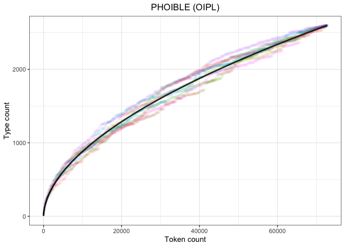
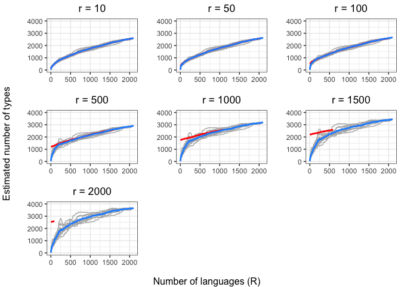
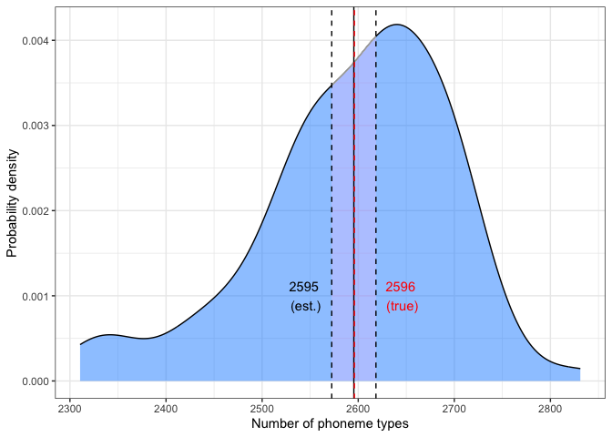

```{r setup, include=FALSE}
knitr::opts_chunk$set(out.width="80%")
knitr::opts_chunk$set(echo = TRUE, error=F, warning=F, message=F, cache=T)
```

<!--
output:
  pdf_document:
    latex_engine: xelatex
    toc: true
    number_sections: true
-->

# Abstract {-}

How many speech sounds are there in the world's languages? To answer this question, we extend two formal models of lexical diversity to segmental phonology. Zipf's law states that most word types are rare; Herdan-Heaps' law states that vocabulary size grows indefinitely with increasingly new text. We find that both models produce accurate estimates of the diversity of contrastive speech sounds (phonemes) in existing typological databases. Our findings suggest that (a) most phonemes are difficult to detect because they are rare, and (b) documenting more phonological repertoires cross-linguistically always yields more phoneme types. As a sanity check, we apply an unrelated estimator of species diversity from biology, Chao-Shen, and show that its estimates align with Herdan-Heaps' law. We use both models to extrapolate phoneme counts to undocumented languages, resulting in an estimate of 4600-4900 distinct phonemes in the full set of languages thought to be spoken today (~7-8k), which is roughly 1.5x more than what is currently documented in the world's languages (~35%). By extrapolating to hypothetical sample sizes, e.g., the number of languages estimated to have been spoken through time, and beyond, we find no indication of convergence: infinite languages mean infinite phonemes.

<!-- How many speech sounds are there in the world's languages? To answer this question, we extend two formal models of lexical diversity -- Zipf's law and Herdan-Heaps' law -- to segmental phonology. Zipf's law states that most word types are rare; Herdan-Heaps' law states that vocabulary size grows indefinitely with increasing amounts of new text. We find that both models produce accurate estimates of the diversity of contrastive speech sounds, aka *phonemes*, in existing typology databases. Our findings suggest that (a) most speech sounds are difficult to detect because they are rare, and (b) documenting more phonological repertoires always yield more phonemes cross-linguistically. As a sanity check, we apply an unrelated estimator of species diversity from biology, Chao-Shen, which combines information about rare types and sample size. We find that the number of phonemes predicted by Chao-Shen align with those predicted by Herdan-Heaps' law. We then use both models to extrapolate phoneme counts to undocumented languages. Our results suggest that there are between 4600-4900 distinct phonemes in the full set of languages thought to be spoken today (~7-8k). This figure is roughly 1.5 times the number of currently documented speech sounds found in the broadest typological databases available (~35\% of the world's languages). By extrapolating to hypothetical sample sizes, e.g., the number of languages estimated to have been spoken through time, and beyond, we find no indication of convergence: infinite languages mean infinite speech sounds. -->

*Keywords*: speech, phonetics, phonology, language, Zipf's law, Herdan-Heaps' law

***

# Introduction

Under the umbrella of linguistic typology, studies of language diversity aim to catalog the range of variation in comparable structures across the world's languages. For some areas of variation, the problem is moot, i.e., the full range of options is known *a priori*. For example in grammar, the relative ordering of a verb (V) and its direct object (O) allows for exactly three possible types: OV, VO, and OV/VO. Thus, every language falls into one of these categories. Other linguistic domains are not logically constrained in this way because the true diversity of types is inherently unknown. 

Consider the set of possible speech sounds in the world's languages. Phonemes are distinguished according to their articulatory, acoustic, and perceptual properties. However, these properties exist in a continuous temporal and physical space, which can be carved up in infinitely many ways. For example, at suitably fine-grained levels of measurement, no two realizations of the same phoneme will ever be identical in every dimension of variation. 

Thus, each new word presents a non-zero probability of containing a previously unheard sound, and by extension, new phoneme. Complicating matters, our current pool of "consensus phonemes" -- however defined -- is subject to re-evaluation in response to advances in data collection, methods, tools, theories, and experience that inform language documentation and analysis.^[In the last 20 years or so, grammars and phonological descriptions (e.g., *Illustrations of the IPA*) increasingly include detailed data and acoustic phonetic analysis using software, such as Praat [@Boersma2001]. This makes phonetic interpretation open to a wider audience.] 

<!-- Physiological differences between speakers' vocal tracts means that equivalance does not exist at the acoustic level. As Papcun notes, "Although various scholars have claimed that phonetic quality is particularly a function of one or another of these domains, this is an incorrect notion. Rather, phonetic quality must be defined in all its domains and mappings must be found between them." -->

The problem is therefore to determine whether there is some sample size of languages after which no amount of additional phonological inventories will yield an unseen phoneme type. The absence of a limit would raise important theoretical issues for the description of phonemes, including questions concerning the role of phonetics in phonology [@Whalen2019] and the importance of cross-linguistic variation [@Hockett1963;@EvansLevinson2009].

The present study seeks to determine whether such a limit exists. To meet this goal, we propose several methods for modeling the relationship between sample size and number of linguistic types. We apply these methods to ask three core questions. First, how many phonemes are there in the world today (based on a limited sample)? Second, how many phonemes have there been in the history of human language? And lastly, how many phonemes are possible in human language? In Section 2, we motivate our research questions. In Section 3, we describe the data and in Section 4 we present our methods and results. In Section 5, we discuss our results and avenues for future research.


<!-- In sum, we show that segment type distributions in typological databases follow Zipf's law, which motivates a connection to Herdan-Heaps' law. We then evaluate these distributions against Herdan-Heaps' law and find a tight fit. We then evaluate these results against an independent type estimator from biology, the Chao-Shen estimator [@ChaoChiu2016], and compare how they both perform on various subsets of known languages' phonological inventories. Lastly, we use both estimators to predict the number of segment types in increasingly larger and undocumented samples of languages. To conclude, we discuss why we expect that ever increasing linguistic diversity leads to an ever increasing number of phonemes, and the broad applications that these methods have for inferring the number of linguistic types more generally.-->


# Motivation

The question of whether there are limits on the number of distinct speech sounds that can appear in spoken languages has been recognized for some time. Alexander J. Ellis (1814--1890) stated as early as 1848 that the number of different speech sounds, i.e., candidate phonemes, is in principle infinite. At that time, teachers and philologists aimed to develop a transcription standard that could discriminate between all manners of speech sounds with orthographic symbols for purposes that included (particularly English) spelling reform and orthography development for newly documented and unwritten languages (e.g., for bible translation). But as practitioners increasingly converted the articulations of more and more languages into a universal phonetic alphabet, the need for new symbols also seemingly increased without limit [@Hockett1995-phoneme, pg. 63].^[This early work later became the basis for the International Phonetic Association (and its phonetic alphabet; both abbreviated IPA). First published in 1888, today the IPA provides and maintains a speech transcriptional device that encodes aspects of articulation, and acoustics, for both narrow (phonetic) and broad (phonemic) transcription. It is comprised of a set of alphabetic symbols and diacritics with the aim of representing all possible sounds in the world's spoken languages (there are extensions for disordered speech and speech pathology). The IPA provides a summary of linguists' phonetic knowledge. This system uses a set of "base" symbols, e.g., letters or combination of letters, that aim to encode phonemes, and the use of diacritics on base glyphs to provide phonetic detail. Its design also affords infinite transcription possibilities.] Finer and finer distinctions in phonetic detail created more and more space for novel phonemes to emerge. Thus, if the phonetic distinctions to be drawn are infinite, then tautologically so are the number of possible phonemes.

If there was any doubt about the infinite nature of the speech signal, instrumental phonetics put the nail in the coffin. Jean-Pierre Rousselot (1846--1924) studied acoustic properties of speech with the kymograph, originally developed to measure physiological patterns such as blood pressure. The later advent of the phonograph by Thomas Edison (1847--1931) in 1877 provided a means to record and reproduce sound. Then during WWII the sound spectogram was developed in secret to analyze ciphony by making sounds visible. The work on visible speech was released publicly after the war [@Potter1945] and the spectrogram became the staple of acoustic phonetic analysis beginning with @Joos1948 (Joos was the first linguist to have extensive access to the acoustic spectrograph). For speech, it measured fluctuations in air pressure, which capture duration, pitch, and intensity. Thus, the ability to record, measure, and visualize speech shows that it is dynamic and continuous, even if listeners perceive it as discrete, e.g., phonemes, syllables, words.^[This relationship between continuous and discrete is at the core of the debate about the interface between phonetics and phonology [@Whalen2019]. The division goes back to at least the late 19th century when phoneticians and dialectologists including Henry Sweet (1845--1912; 1877) and Jost Winteler (1846--1929; 1876) began making a distinction in language descriptions between sounds that change the meaning of words and those that do not.]

Aside from the acoustic-phonetic argument, evidence for infinite phonemes comes from studies on the cross-linguistic frequencies of speech sounds. Early evidence is found in a large cross-linguistic sample of phoneme inventories, where inventory is understood as the set of distinctive sounds attested in a language. This sample is described in the UCLA Phonological Segment Inventory Database (UPSID; @Maddieson1984, @MaddiesonPrecoda1990). @Maddieson1984 created a genealogically-balanced sample of the world's languages (*n* = 317) to investigate cross-linguistic properties of phonological systems and the relationship between aspects such as inventory size, contents, and structure. Maddieson noticed that certain segments are more or less likely to be present in inventories regardless of their size. That is, certain sounds are almost always present and others are almost never present. In other words, no segment occurs in every language and some very frequent segments occur in most languages. Moreover, nearly half of the reported segment types are singletons in the sample, i.e., one-off language-specific occurrences.^[Whether rare segments occur more or less frequently *within* a language is a language-by-language research question. See for example @Everett2018.] While Maddieson did not explicitly test for it, his observations fit a well-attested pattern known as Zipf's law [@Zipf1936;@Zipf1949]. Zipf's law states that the frequency distribution of words in a language is inversely proportional to their frequency rank. The relationship is log-linear: high frequency words are few in number but account for most of the tokens in a text, and low frequency words are many, but occur rarely or even just once.^[Here is a plot showing Zipf's law in the first 10 million words in the Wikipedias from 30 different languages: https://en.wikipedia.org/wiki/Zipf%27s_law#/media/File:Zipf_30wiki_en_labels.png.] , Zipf's law states that the frequency of an element $f(r)$ is proportional to the inverse frequency rank of that element (modulated by an exponent $\alpha$) [@Piantadosi2014]:^[@Piantadosi2014 discusses in detail that word frequency distributions are not actually as simple as they seem according to Zipf's law. For example, semantics affects word frequency distributions. Moreover, observations of Zipf's law have been obscured by word frequency distribution plots that fail to address correlated errors. Zipfian distributions are not unique to language. They appear in various aspects of human society, such as music and aspects of the internet, as well as in other biological and physical systems. Strikingly, power law distributions can arise from nearly nothing [@Piantadosi2014, p. 1121].]

$$
f(r) \propto \frac{1}{r^\alpha}
$$

The Zipfian distribution characterizes many aspects of language (and other natural phenomena). Two features make it interesting for our purposes. First, it describes systems for which most types are rare, hence difficult to observe. Second, under certain conditions ($\alpha \ge 1$), the Zipf function is non-asymptotic: more types can always be added at the rank for singletons, and the expected type count computed. The fact that Maddieson's observations are consistent with the Zipfian distribution suggests that phoneme types are indeed difficult to discover (particularly at the fringe) and that there could be some room left for additional phonemes.

@Moran2012 revisited the frequency distribution of segments in a larger sample of the world's languages (*n* = 1780, including UPSID) and showed that the relationship between cross-linguistic segment frequency follows a similar pattern as in the @Maddieson1984 (*n* = 317) and @MaddiesonPrecoda1990 (*n* = 451) UPSID language samples. That is, some phonemes are very frequent across the world's languages, and half of all documented phonemes are language-specific. @Moran2012 also did not explicitly test whether cross-linguistic phoneme frequency adheres to a Zipfian distribution,^[@Moran2012, p. 212 does provide a log-log plot of segment frequencies that is Zipfian-esque.] but he does show that the cumulative number of segment types seems to be bounded to infinity; the curve appears quadratic and showing no sign of a slowing towards an asymptote.  

In Figure 1, we reproduce these plots using the genealogically balanced UPSID-451 language sample [@MaddiesonPrecoda1990] and compare it to the data available in the latest version of PHOIBLE Online [@MoranMcCloy2019], which contains 2186 languages.^[Note that although nearly half of the segments in the language samples occur in particular languages, some languages contain more than one segment not found in any other languages in the sample. This is most apparent from the rich phonological inventory of Juǀʼhoan (ISO 639-3: ktz; Glottocode: juho1239; aka !Xu, ǃXun, Southeastern ǃKung), which has been described as having 141 phonemes -- 66 of which occur in no other documented language [@Snyman1970;@Snyman1975;@MaddiesonPrecoda1990].]

<!--
```{r upsid, echo=FALSE, fig.align="center", fig.cap="\\label{fig:upsid}Cumulative segments in UPSID-451"}

```

```{r phoible, echo=FALSE, fig.align="center", fig.cap="Cumulative segments in PHOIBLE 2.0"}

```
-->

```{r phoible_upsid, echo=FALSE, fig.align="center", fig.cap="Cumulative segments in PHOIBLE 2.0 and UPSID-451"}

```

These plots resemble the distribution of another, less-commonly known linguistic law: Herdan's and/or Heaps' law. Originally proposed by Gustav Herdan [-@Herdan1964], but frequently attributed to Harold Heaps [-@Heaps1978] in the information retrieval literature [@Egghe2007], Herdan-Heaps' law describes the number of distinct words within a document as a function of the document's (or combined documents') length in terms of total word count. More specifically, Herdan–Heaps' law states that, as more of a text is consumed, the rate of never-before-seen words per unit diminishes (but does not reach 0). This makes intuitive sense given what we know from Zipf's law: most words are hard to find, and most of the words that you can find, you have seen before. In fact, Herdan–Heaps' and Zipf's laws have been shown to be asymptotically equivalent with respect to individual word frequencies within corpora [@BaezaNavarro2000;@vanLeijenhorst2005]. Both of these laws are instances of the same fundamental property: token counts can be inferred from type counts and vice versa [@Milivcka2009].

Herdan-Heaps' is expressed  as:

$$
V_{R}(n)=Kn^{\beta }
$$

where $V_{R}$ is the number of distinct words in a text of size _n_ and _K_ and $\beta$ are the free parameters that are determined empirically. An illustration of a typical Herdan-Heaps' curve for English text is given in Figure 2 (compare to Figure 1 above).

```{r heaps, echo=FALSE, fig.align="center", fig.cap="A typical Herdan-Heaps plot, where x-axis denotes text size and the y-axis the number of distinct vocaulary items (Source: Wikipedia)."}
knitr::include_graphics("figures/Heaps_law_plot.png")
```

Herdan–Heaps' law has been validated using large corpora of naturally occurring discourse. For example, in a corpus of 50 million words, @Kornai2002 found that iteratively adding more text always led to the discovery of more unique words. @BrantsFranz2006, using a custom one-trillion-word corpus of English, showed that even with nearly 14 million word types, the growth in vocabulary showed no sign of stopping.^[Note that "words" at the trillion-word scale corpus include all segmentable substrings, including alternate spellings for the same target word. These alternatives can be numerous. For example, Google's spell correction system has detected nearly 600 different spellings for the query *britney spears*: http://archive.google.com/jobs/britney.html.] 

We can apply the same approach to phonemes nested within inventories. By analogy to words and documents, phonemes are the words, and the concatenated inventories of a sample of languages (*L*) is a document. The "document" is expanded by considering new, entire phoneme inventories one language at a time. Any new phonemes are added to the existing set and the new count recorded (as in Figure 2 above). If the phoneme type counts predicted by Herdan-Heaps' law match those of the known sample of inventories, we can then extrapolate the trend to larger number of inventories. For example, how many phonemes potentially exist in the full (but only partially documented) set of the world's 7151 spoken languages.^[This estimate is taken from Ethnologue ( https://www.ethnologue.com/guides/how-many-languages?).] What about even more languages? How many phonemes may have existed throughout time? And what is the upper bound on the number of distinct phonemes? Is there one? Or does Herdan–Heaps' law suggest that the number of phonemes in languages is potentially infinite?

<!-- The outline of this research report is as follows. In the next section, we describe the data and then present our methods and results. First, we show that the segment type distributions in both the UPSID and PHOIBLE language samples follow Zipf's law. This helps us motivate a connection to Herdan-Heaps' law and provides initial support for infinite phonemes. Second we evaluate the segment distributions in each database against Herdan-Heaps' law. Third, as a point of independent evidence to evaluate the findings of Herdan-Heaps' law, we apply a second estimator of type counts, which we refer to as the Chao-Shen estimator [@ChaoChiu2016]. The Chao-Shen estimator was developed to estimate the richness of species in biology from limited sample sizes, but we apply it to phonological inventories. Fourth, we compare how each estimator performs when predicting the number of phonemes in subsets of the language samples in PHOIBLE. This step allows us to evaluate the various count estimates against known data. Fifth, we compare the results from Herdan-Heaps' law and the Chao-Shen estimator and show that (a) the Chao-Shen estimator "seeks out" a curve described by the Herdan-Heaps' equation and (b) evidence from both estimators suggests that there is no upper bound on the number of segment types. Lastly, we use both Herdan-Heaps' and the Chao-Shen estimator to predict the number of segment types in increasingly larger -- and undocumented -- samples of languages. To conclude, we discuss why we expect that ever increasing linguistic diversity leads to an ever increasing number of phonemes and how this work has broad implications for inferring the number of types of other linguistic elements more generally. -->

# Data

For this study, we use the latest PHOIBLE data, which includes 3020 phonological inventories from 2186 distinct languages, covering 3183 distinct phonemes [@MoranMcCloy2019]. The dataset is a convenience sample of languages, in which some geographic regions and language families have greater or lesser coverage. Included in PHOIBLE is UPSID-451 [@Maddieson1984;@MaddiesonPrecoda1990], a genealogically balanced sample of languages in which each data point was selected as a representative of its language family. Therefore, we use both UPSID and PHOIBLE as baselines to evaluate our models.

Our central question concerns how the number of spoken languages that are documented relate to the number of unique phonemes that are observed. This is a question of cumulative growth. It can be rephrased as: if we have seen *x* languages with *y* unique phonemes, how many unique phonemes do we expect to find in $x + i$ languages?


# Methods and results

## Zipf's law

First, we test whether the segment distribution in the databases follow [Zipf's law](https://en.wikipedia.org/wiki/Zipf%27s_law). Figures 3 & 4 plot log frequency (y-axis) by log frequency rank (x-axis) for UPSID and PHOIBLE, respectively. The circles represent the cumulative distributional counts of each phoneme. The blue dotted line represents predictions based on Zipf's distribution using the following equation:

$$
\begin{aligned}
  f(rank;a;b;c) & = \log{\frac{c}{(rank+b)^a}} \\ 
  &= \log{(c) + a \cdot\log{(rank + b)}}
\end{aligned}
$$

where $a$, $b$, and $c$ are tunable parameters. In this case, we determined the optimal parameters using non-linear least squares regression as implemented in the *nls* function from the *stats* package (v. 3.6.2) for the programming environment *R* (*R* Core Team, 2019).

```{r upsid_zipf, echo=FALSE, fig.align="center", fig.cap="\\label{fig:upsid}Cumulative segments in UPSID-451 follow Zipf's law"}

```

```{r phoible_zipf, echo=FALSE, fig.align="center", fig.cap="Cumulative segments in PHOIBLE (OIPL) follow Zipf's law"}

```

The close fit between the observed curve and the predictions drawn from a Zipfian distribution suggests that global phoneme distributions are Zipf-distributed.^[We note the debates in the literature on what the underlying distributions are of phoneme inventory size (e.g., @Lehfeldt1975, @JustesonStephens1984, @Maddieson2008) and of phonemes frequencies in text [@Martindale_etal1996;@TambovtsevMartindale2007;@Macklin-CordesRound2020]. But here we are specifically looking at presence of phonemes in phonological inventories cross-linguistically.] Note that this close approximation holds for both the genealogically balanced and large-scale databases.


## Herdan–Heaps' law

The distribution of phonemes in both language samples are clearly Zipfian. We next test whether their distributions likewise follow Herdan–Heaps' law. Does the number of yet-to-be-seen segment types decrease as the number of phonological inventories observed increases by way of a power law relation? 

An important feature of the Herdan-Heaps' equation is that it can be expressed in the form of a standard linear equation by simply taking the logarithm of each term, or:

$$
\begin{aligned}
  \log d & = \log (K + n^B)\\
  & = \log K + B \cdot \log n
\end{aligned}  
$$

which has the familiar form: 

$$y = \beta_0 + \beta_1 \cdot x$$

This gives us the added benefit of being able to fit a log-transformed linear regression model to the data, such that:

* The resulting intercept is the optimal $K$ (with some back-transformation: $K = e^k$).
* The coefficient $\beta_1$ expresses $B$.

With these values, we can estimate the type count for any sample size $n$ using the standard Herdan-Heaps' equation. As proof of concept, we estimate the number of phonemes for both UPSID-451 and PHOIBLE. Some languages in PHOIBLE are associated with more than one doculect. To avoid an overrepresentation bias, we randomly sample one doculect from every language or take the single doculect where only one exists (one inventory per language, or OIPL. Results of a preliminary analysis indicated that the full and OIPL versions of PHOIBLE behaved similarly. We therefore focus on the results from the OIPL database here (see the supplementary materials for comparisons between the full and OIPL versions).

We begin by randomly permuting the order of inventories and computing the cumulative number of unique segment types for each new language observed. Then we repeat this process $k$ times (we set k=10 trials) for each database. We fit a log-linear regression to the resulting sets of estimates to generate empirically optimal values for $B$ and $K$ -- our two free parameters in the Herdan-Heaps' equation.

Figures 5, 6 & 7 show the predicted values against the true values of the number of segment types (phoneme type count) versus segments recorded in phonological inventories in the samples (segment token count). Model fits for the UPSID-451 and PHOIBLE language samples suggest that the phoneme type versus token count closely follows Herdan-Heaps' law.^[In the supplementary materials, we also fit a "one inventory per language" (OIPL) model of PHOIBLE to show that the language sample's genealogical and areal biases, e.g., the sample is more representative of African languages than other world areas, are not affected by simply sampling the whole database. The outcomes between a stratified random resampling and testing the segment type versus token on the entire convenience sample are nearly the same.]

```{r upsid_heaps, echo=FALSE, fig.align="center", fig.cap="\\label{fig:upsid}Cumulative segments in UPSID-451 follow Zipf's law"}

```

```{r phoible_heaps, echo=FALSE, fig.align="center", fig.cap="\\label{fig:upsid}: Cumulative segments in PHOIBLE (OIPL) follow Zipf's law"}

```

Next, we compare the model parameters across the two databases, UPSID-451 and PHOIBLE. The values for $B$ and $K$ are relatively similar. UPSID-451 and PHOIBLE (all) have nearly identical values for B, but they differ in the scalar K, which explains the sharper increases in segment type counts for PHOIBLE.

| Database | B | K |
|----------|---|---|
| UPSID | 0.4994352 | 8.087208 |
| PHOIBLE (OIPL) | 0.5442040 | 5.870403 |

We illustrate these parameter differences in Figure 7 by combining the plots on the same scale. The curve describing Herdan-Heaps' estimates based on UPSID-451 has a shallower trajectory than the curve based on PHOIBLE. Nevertheless, both curves are highly similar. This similarity indicates that the known areal and genetic biases present in PHOIBLE do not have much of an effect on the modeling of phoneme diversity. Based on this finding, we focus on the larger and more complete database, PHOIBLE, in the remaining analyses.

```{r compare_models, echo=FALSE, fig.align="center", fig.cap="\\label{fig:upsid}: Cumulative segments in UPSID-451 and PHOIBLE (OIPL) follow Herdan-Heaps' law"}

```

Next, we implement a general and flexible estimator for type counts called the Chao-Shen estimator [@Chao_etal2009;@ChaoChiu2016]. If the results from the two estimators (Chao-Shen and Herdan-Heaps' law) converge, then we have a more solid foundation for extrapolating phoneme counts for larger, hypothetical sample sizes.


## The Chao-Shen estimator

The Chao-Shen estimator was developed to determine the diversity of species within an ecosystem given only limited (spatial and temporal) sampling [@Chao_etal2009;@ChaoChiu2016]. It allows us to extrapolate the number of types in some population based on an incomplete sample using the number of rare types and an estimate of the number of unobserved types.

This estimator takes as input an incidence matrix and returns the expected number of types in a larger (imaginary) sample. An incidence matrix is a record of the presence or absence of the types being sampled from a set of sampling units. For example, imagine that an entomologist is interested in identifying how many types of beetles are in a forest. She knows from prior research that there are 1000 documented species of beetles in the area. In order to get a representative sample of the diversity of beetle species in the overall ecosystem, she sets up 50 beetle traps, regularly spaced across the forest. In this example, the traps are the sampling units and the species of beetles are the types. The entomologist prepares a 50 X 1000-cell spreadsheet in which the rows and columns correspond to the traps and known beetle species, respectively. She then visits each trap and for each of the 1000 known species of beetle she finds, she records a 1 for that species in appropriate cell. All unseen species are given a value of 0. The result after all traps have been visited is a 50 X 1000 incidence matrix. The information contained in this matrix can then be fed into the Chao-Shen estimator to provide an estimate of the true diversity of beetle species in the forest.   

The same approach can be extended to languages and their phonemes. On analogy with the beetle example, the forest is the sum of the human-populated areas of Earth; the beetle traps are all documented human languages; and the beetles are the phonemes which appear in those languages. The incidence matrix is of shape *l* X *s*, where *l* is the number of documented languages and *s* is the number of types of segments that have been documented as phonemes in at least one language. By definition, if a segment appears as a phoneme in a given language, the corresponding cell in the incidence matrix contains a 1; otherwise, it contains a 0. 

Table 1 shows a hypothetical example of an incidence matrix for 150 observed segments from a set of $S_{obs}$ phonemes in $R$ languages. Marginal sums are given per language ($\sum_{language}$, or *inventory size*) and per segment ($\sum_{phoneme}$, or *cross-linguistic prevalence*)

|Phoneme|Lang<sub>1</sub>|Lang<sub>2</sub>|&middot;&middot;&middot;|Lang<sub>*R*</sub>|&sum;<sub>phoneme</sub>|
|:---:|---|---|:---:|---|---|
|**Phon<sub>1</sub>**|1|0|&middot;&middot;&middot;|0|1|
|**Phon<sub>2</sub>**|0|1|&middot;&middot;&middot;|1|2|
|&middot;&middot;&middot;|&middot;&middot;&middot;|&middot;&middot;&middot;|&middot;&middot;&middot;|&middot;&middot;&middot;|&middot;&middot;&middot;|
|**Phon<sub>*S*<sub>obs</sub></sub>**|1|1|&middot;&middot;&middot;|1|30|
|**&sum;<sub>language</sub>**|15|23|&middot;&middot;&middot;|6|150|

Table: Hypothetical sample of an incidence matrix

Using the definitions provided above, the Chao-Shen estimator is expressed formally as follows:

$$ \hat{S}_{\text{Chao-Shen}} = S_{\text{obs}} + \hat{Q}_0 \left[1 - \left(1 - \frac{Q_1}{Q_1 + R \cdot \hat{Q}_0}\right)^r\right] $$

$S_{obs}$ is the number of segment types that have been observed overall. $R$ is the number of languages in the observed sample. $Q_1$ is the number of segment types that have only been observed once (*singletons*), e.g., Phon<sub>1</sub> in Table 1). The hyperparameter $r$ expresses the number of new languages that we wish to add (hypothetically) to our existing sample. Finally, $\hat{Q}_0$ is the estimated number of unobserved types that were nevertheless "truly" present. We do not have empirical access to this figure -- we cannot directly measure how much we haven't seen. Therefore, it must be inferred. $\hat{Q}_0$ can be derived in many ways. Here, we use the following equation.

$$ \hat{Q}_0 = \begin{cases} S_{\text{obs}} + \left[\frac{R-1}{R}\right] \frac{Q^2_1}{2 \cdot Q_2} & \text{if }Q_2 > 0 \\ S_{\text{obs}} + \left[\frac{R-1}{R} \right] \cdot Q_1 \cdot \frac{Q_1-1}{2} & \text{if }Q_2 = 0\end{cases}$$

In this equation, $Q_2$ stands for number of segment types which were observed exactly twice, or *duplicates* (e.g., Phon<sub>2</sub> in Table 1). 

Similar to the Herdan-Heaps' equation, we can test how well the estimates of the model match known values based on increasing sample sizes. However, unlike Herdan-Heaps', the Chao-Shen estimator requires a hyperparameter that stipulates how many *additional* observations it should consider in making its estimate. It looks ahead to larger samples, rather than at the current sample size. We must therefore approach this problem differently. Our solution is to sample repeatedly from our set of languages, each time increasing the number of languages $R$ by an increment of $d$. For each value of $R$, we compute the Chao-Shen estimates for several values of $r$, each time increasing $r$ by $c$ additional observations. 

The entire procedure is thus:

1. Pick a random set of phonological inventories of size $R_s$
2. Compute the frequency vector of the segment types
3. Apply the Chao-Shen estimator for $r$ with $R = R_s$
  3a. Increase $r$ by $c$ 
  3b. Repeat 3a until maximum $r_{\text{max}}$ is reached
5. Repeat steps 1-3 $k$ times
  5a. Increase $R_s$ by $d$

Figure 8 shows the results of applying this procedure to PHOIBLE. $k$ is arbitrarily set to 10 iterations. The relatively small degree of variation across iterations suggests that this value is suitably high. *d* was set to 10. *r* was manually adjusted to exemplify behavior at different scales (within the limits afforded by the overall sample size). Grey lines represent the Chao-Shen estimates for each iteration, and blue lines give the means. Red lines represent the mean of the true number of observed types across iterations. Red lines become shorter as *r* increases because we have fewer true values to compare against when we look further ahead from any position (i.e., fewer values of *R* for which we can look *r* steps ahead). 

```{r chao_lang_types, echo=FALSE, fig.align="center", fig.cap="\\label{fig:chao_lang_types}Estimated segment types by number of languages"}

```

The first thing to notice about these plots is that they closely resemble the Herdan-Heaps' curve that we generated from PHOIBLE. These plots thus also point to slowing but non-asymptotic growth of type counts. 

Regarding the behavior of the parameters, the Chao-Shen estimator shows near-perfect prediction across values of *R* when *r* is relatively small. That is, the model is very good at predicting known segment type counts for samples with relatively fewer additional languages (small *r*), regardless of the number of observed languages (all *R*). If we compare the panels against one another, particularly at lower values of *R*, we see that the differences between the true values (red lines) and the estimated values (blue lines) increase with *r*. As *r* increases, so does the degree of underestimation. In other words, the model is more conservative in its guesses when data are sparse and the distances of extrapolation are large. The underestimation appears to dissipate around *R* = 1000. Figure 9 plots this relationship directly.

```{r chao_error_estimates, echo=FALSE, fig.align="center", fig.cap="\\label{fig:chao_error_estimates}Chao error estimates in PHOIBLE"}

```

Variability across iterations increases with *r*, particularly for sample sizes of ~1700 languages or fewer. This pattern indicates that larger values of *r* should be compensated for by larger values of *R*. Otherwise, the results may not generalize well to other samples (even if the other samples are drawn from the same underlying pool, as we have shown here!).  

To summarize, estimates converge on the observed values earlier on average when *R* is larger relative to *r*. Thus, we do better when we have more data and predict values closer to our observed sample. In addition, the variability in estimates across iterations (grey lines) increases with *r* and decreases with *R*. Thus, our estimates are noisier when we look further ahead and have smaller samples. Together these findings suggest two things: (a) the ratio of observed sample size to sample size increase $\frac{R}{r}$ should be maximized to reduce sample-induced noise, and (b) *R* should be maximized to fight the underestimation bias.

Unfortunately, PHOIBLE offers a proportionally small *R* given some of the values of *r* that we would like to investigate. For example, to account for the estimated number of current languages, we would need *r* = 7151 - 2099 = 5052, a value almost 2.5 times as large as our observed *R* (2099). Extrapolating from our known sample to the estimated number of world languages therefore requires an undesirably small proportion $\frac{R}{r}$ -- around 0.42. That said, our data suggest that sample sizes of ~1000 languages produce estimates that closely approximate the true segment type counts, even as *r* increases. In other words, after 1000 languages, increases in *R* do less to mitigate the underestimation bias. Given that PHOIBLE contains more than double that number of languages, we have no reason to suspect significant underestimation for the relatively large values of *r* that we investigate here. However, because of the small ratio of *R*:*r*, we should expect our estimate to come with greater uncertainty.

We have so far described the distributional properties of our databases, associated their behavior with two linguistic laws, and introduced two methods for inferring type counts from an observed frequency distribution. We now explore in more detail how well the two type estimators -- Herdan-Heaps' and Chao-Shen -- perform when predicting the total segment type diversity of a database from an incomplete subsample. 


## Predicting known segment type diversity

To establish whether we can reliably estimate the number of segment types in a known sample, we evaluate the accuracy of each estimator in predicting the known type count given a fixed-size random subsample. From PHOIBLE (*n* = 2099), we randomly select 1500 languages – an arbitrary number that includes roughly three-quarters the number of languages in the total sample. Note that this value was set above the threshold of *R* = 1000 (reported above for the Chao-Shen estimator) to help support prediction accuracy.  We then extrapolate our model parameters from this random sample and use them to predict total segment type diversity in PHOIBLE. We iterate this process *k* = 100 times. 

The Herdan-Heaps' estimates are visualized in Figure 10. The mean is plotted as a solid black line. The 97.5% confidence intervals (CIs) are plotted as dotted lines around the mean. The red dotted line indicates the true number of phoneme types. Blue shading indicates the density function of the estimated values from the 100 iterations.

For this run of 100 iterations, the Herdan-Heaps' estimator overestimated the true value by ~18 segment types on average (~2613 estimated vs. 2596 observed).

```{r hh_ci, echo=FALSE, fig.align="center", fig.cap="\\label{fig:herdan_heaps_ci}Herdan-Heaps' confidence intervals for a sample of 1500 languages"}

```

Next we test the Chao-Shen estimator. We again sample 1500 languages 100 times from PHOIBLE. The results are plotted in Figure 11. 

```{r chao_ci, echo=FALSE, fig.align="center", fig.cap="\\label{fig:chao_ci}Chao confidence intervals on a sample for 1500 languages"}

```

The Chao-Shen estimator overestimates the true value by only 1 type (the estimate is actually closer: 0.56 types). It therefore provides an almost perfect fit. Note that $\frac{R}{r} = \frac{1000}{1099} = 0.91$ (three times the size of what we face with our extrapolation to the world's 7151 known languages). 

The Chao-Shen estimator therefore seems to outperform Herdan-Heaps' law in predicting type counts in PHOIBLE. However, we stress that predictions from both models fall remarkably close to the true value. 

As a final point of comparison, we plot Herdan-Heaps estimates against the corresponding Chao-Shen estimates for increasing sample size and values of *r* (Figure 12). 

```{r comp_plot, echo=FALSE, fig.align="center", fig.cap="\\label{fig:comp_plot}Comparing the Herdan-Heaps' and Chao esimtator"}

```

The black line represents PHOIBLE-based Herdan-Heaps estimates. Grey points reflect true cumulative type counts from 10 reshuffled versions of PHOIBLE. The horizontal dotted red line indicates the total known number of segment types in PHOIBLE. The solid colored lines represent Chao-Shen estimates for different *r* (indicated in the legend). Note that these lines have been shifted along the x-axis to reflect that Chao-Shen estimates look ahead, such that the $\hat{R}$ being estimated is actually *R* + *r*.  

This plot demonstrates several of the points raised above. The Chao-Shen estimates at small *R* and large *r* are gross underestimates of the true value. However, as *R* increases, the estimated values climb quickly towards the true values. What is striking about this plot is that the Chao-Shen estimates seem to "seek out" the Herdan-Heaps curve. For these data, the Chao-Shen estimator has decided that segment type counts grow according to a rate predicted by Herdan-Heaps' law. This need not have been the case; the Chao-Shen estimator is capable of predicting values produced by many different kinds of functions. Finally, and most crucially, neither estimator shows any indication of leveling out: both appear to be non-asymptotic.  


## Extrapolating estimates to unseen numbers of observations

We have so far established that (a) both the Herdan-Heaps' estimator and the Chao-Shen estimator predict unseen type counts accurately and (b) the two ultimately agree on these estimates, though Chao-Shen needs more data to "catch up." We have also shown that the Chao-Shen estimator requires two things to perform well: large ratios of *R* to *r* and generally large *R*. With this in mind, we now apply both estimators to unseen sample sizes. We start with the number of known world languages (7151), then proceed to larger values (10k, 50k, and 100k). 


### Herdan-Heaps' law

Recall that the Herdan-Heaps' equation requires that we know three things: two free parameters, *K* and *B*, and the number of observations *n*. As before, the parameters are optimized using a log-transformed linear regression over cumulative type counts from PHOIBLE. However, determining the third variable -- number of observations -- for an arbitrarily large sample poses a problem. Suppose you have a sample of 100 languages with 1000 total segments (tokens, not types), and you want to guess how many total segments you would find in a sample of 150 languages. Is it simply a linear increase, i.e., 1500? No, or rather we cannot know. We do not know how many sounds each language would contribute in an unseen population, so we cannot directly derive the requisite number of observations from the number of languages alone. Therefore, we need some way to estimate this figure. 

We approach this problem in two ways. First, we sample inventories randomly with replacement from the observed dataset up to a desired number of languages. The steps are as follows:

1. Randomly sample *L* languages from the existing database with replacement
2. Sum the inventory sizes of the resulting sample of languages.
3. Repeat steps 1-2 *k* times

*L* corresponds to the desired number of languages. For example, setting *L* to 7151 will produce the number of segments (tokens) we should expect to see if we had access to the inventories of all known human languages.  

Second, we regress the number of total phonemes on sample size using the observed dataset. The steps are as follows:

1. Randomly sample *l* languages from the existing database with replacement.
2. Sum the inventory sizes of all languages in the resulting sample.
3. Increase *l* by increment *s*
4. Repeat steps 1-3 until desired number of languages (*L*) has been sampled.
5. Repeat steps 1-4 *k* times
6. Fit a regression to the sequences created
7. Use the regression to predict token counts for desired *L*

The result of steps 1-5 is *k* sequences of increasing token counts (by steps of *s*) for independent, random samples *l* languages up to the desired number of languages *L*. Steps 6-7 fit a linear regression to the set of \textit{k} sequences (with random intercept adjustments for the iterations). The resulting model is then used to predict the number of observations for any number of languages.

We apply both approaches to PHOIBLE for samples sizes of 7151, 10k, 50k, and 100k. The mean estimates for Approach 1 and 2 are presented in Table 2.

||7151|10K|50K|100K|
|---:|:---:|:---:|:---:|:---:|
|Approach 1|247623|346234|1731657|3465640|
|Approach 2|247620|346257|1731115|3462189|
|Difference|3|-23|542|3451|

Table: Mean estimates for Approach 1 & 2.

As sample size increases, Approach 1 produces increasingly larger estimates relative to Approach 2. At lower sample sizes, the values are comparable. 

The values from Approach 1 and 2 can now be entered into the standard Herdan-Heaps' equation with *K* and *B* taken from the full-PHOIBLE regression model. Results are given in Table 3.

||7151|10K|50K|100K|
|---:|:---:|:---:|:---:|:---:|
|Approach 1|4850|5770|13282|19025|
|Approach 2|4850|5770|13280|19016|
|Difference|0.02|-0.20|2.15|9.81|

Table: Phoneme type counts for different sample sizes.

Both approaches behave similarly, even producing the exact same estimate for 7151 and 10000 tokens.^[The Supplementary Materials contain an analysis which suggests that most languages tend to settle on a similar number of phonemes, meaning that the overall number of observations can be neatly derived from the number of languages.] 

### Chao-Shen estimator
Recall that the Chao-Shen estimator only requires a single parameter *r*, i.e., the number of additional languages that we wish to sample. To derive *r* for a target sample size, e.g., 7151, we need only subtract our observed *R*, or 2099, from that number. The resulting figure is then plugged into the estimator to get the expected type count $\hat{R}$. The full set of *r* values and corresponding type count estimates are given in Table 4. 

||7151|10K|50K|100K|
|---:|:---:|:---:|:---:|:---:|
|$r$|5052|7901|47901|97901|
|$\hat{R}$|4592|5037|5530.86|5530.92|

Table: *r* values and corresponding type count estimates

Predicted type counts are generally lower than those produced by Herdan-Heaps' law, and this difference increases with *r*. Unlike the Herdan-Heaps' estimator, the Chao-Shen estimator does appear to reach an asymptote. Indeed, increasing *r* beyond 100K always results in the same value: 5530.92. The presence of this asymptote can be explained by the function of *r* in the Chao-Shen equation. *r* serves to exponentiate a term that falls in the range {0,1}. Therefore, as *r* increases, the full term shrinks to 0. The result is subtracted from 1, meaning that as *r* increases, the compound term $1-x^r$ approaches 1. This value controls how much of the estimated number of unobserved types $\hat{Q_0}$ is added to the number of observed types $S_{\text{obs}}$. Therefore, as the compound term approaches 1 per unit increase in *r*, the resulting type count estimates get closer and closer together. Looking too far ahead slows the growth of type count estimates to a crawl. In turn, this slowdown produces increasingly more severe underestimates (as outlined above). The apparent asymptote can therefore be interpreted as a mechanical feature of the Chao-Shen estimator rather than a substantial property of global phonological distributions. 

Figure 13 summarizes the segment type estimates of the two Herdan-Heaps' methods and the Chao-Shen estimator. 

```{r diff_plot_ext, echo=FALSE, fig.align="center", fig.cap="\\label{fig:diff_plot_ext}Type count estimates from the Chap and Herdan-Heaps' estimators for four sample sizes"}
knitr::include_graphics("README_files/figure-gfm/diff_plots_ext-1.png")
```

The two approaches to estimating *n* for Herdan-Heaps are nearly identical. Furthermore, we see diminishing rates of increase of the estimates (going from 10K to 50K results in a greater increase than going from 50K to 100K). For smaller *r*, the Chao-Shen and Herdan-Heaps' estimators behave similarly. As *r* increases, the degree of difference between the two estimators increases (as predicted based on the underestimation bias reported above for Chao-Shen).

To summarize our main findings: (a) Herdan-Heaps' law fits the known phonological diversity well, (b) a different strategy for estimating type count performs best when it mimics Herdan-Heaps' law, (c) we therefore have no reason to believe that there is a limit to the number of phonemes to be observed in human languages, and (d) even if limited, the true number is most likely much larger than what we have documented so far.


# Discussion

The present study asks a seemingly straightforward question: how many different phonemes are possible in human language? We cannot determine this number empirically from existing resources because the vast majority of languages, known or unknown, are undocumented, extinct, or both. Moreover, differences in documentary practice (theoretical and/or methodological) mean that even our existing phonological descriptions are provisional and objects of debate. For example, PHOIBLE contains approximately 1.4 different inventories per language.^[Different inventories per "language" mean they do not agree on the number or exact repertoire of phonemes. However, this should be expected given that phonological descriptions typically represent different doculects, i.e., different instances of linguistic behavior at different places, times, or with different speakers [@GoodCysouw2013] and that phoneme analysis is a non-deterministic process [@Chao1934;@Hockett1963].]

To address these issues, we modeled the distributional properties of documented phonemes. First, we found that frequencies of phoneme types in existing cross-linguistic databases are well described by Zipf's law, regardless of whether samples were controlled for areal and genetic biases. Systems that obey Zipf's law, under mild assumptions, also follow Herdan-Heaps' law [@BaezaNavarro2000;@vanLeijenhorst2005], which predicts type count from the number of tokens with only two tunable parameters. Herdan-Heaps' law was originally intended to describe how vocabulary size increases as more words are observed in a document or set of documents. Extending this approach, we demonstrate that the number of phoneme types in a sample of languages also grows according to Herdan-Heaps' law. To our knowledge, we are the first to apply Herdan-Heaps' law to the domain of segmental phonology by reformulating it as estimator of the number of phonemes in groups of languages. Finally, we verify the goodness-of-fit of Herdan-Heaps' by applying an additional and formally unrelated tool borrowed from ecology, which we refer to as the Chao-Shen estimator. The predictions of this estimator confirm that the relationship between sample size and segment type count is best described by a curve that approximates Herdan-Heaps' law. Most importantly, the optimal Herdan-Heaps' model did not converge on any single number of phoneme types as number of languages increased.

Assuming a target of 7151 known languages,^[https://www.ethnologue.com/guides/how-many-languages?] our models predict a range of total segment types from 4592 to 4850 (mean = 4721). Based on PHOIBLE, our current best guess of the diversity of documented phoneme types is 3183. Therefore, the models argue for the existence of approximately 1500 yet to be documented phoneme types. As we probe increasingly larger and theoretically motivated language sample sizes, i.e., languages that existed *through time* (e.g., estimates including 30k-500k [@Pagel2000] or 64k-140k [@Crystal2002]), the Herdan-Heaps' model predicted a continual increase in the number of unique phonemes, reaching values as high as 19K. The Chao-Shen model produced much more conservative estimates for samples of size 10K and above, even appearing to settle on an asymptote of roughly 5500 phonemes for samples of 100K languages or more. However, when we compare the predictions of Herdan-Heaps and Chao-Shen  against known type counts in a closed dataset, the source of the discrepancy emerged: as the sample grows, Chao-Shen lags behind Herdan-Heaps in approximating the true value. Thus, given a larger pool of training data, we expect Chao-Shen to approximate more closely the estimates of Herdan-Heaps' law.

We therefore provisionally conclude three things: (1) adding languages to a sample will always carry a non-zero probability of producing a novel phoneme; (2) in accordance with Herdan-Heaps' law, the rate at which new phonemes are discovered per language will always decrease; and (3) the decrease in the rate of new observations will never reach 0. Thus, based on the evidence presented here, we have no reason to believe that there is an upper bound on the number of unique phonemes possible in spoken languages. Infinite linguistic diversity seems to breed infinite possible phonemes. But what would it mean if there were indeed infinitely many potential phonemes?

If one adopts a feature-based perspective on the phonetic targets of phonemes, then there is an *a priori* upper bound of $2^F$ contrastive sounds, where $F$ is the number of feature categories and 2 reflects the choice between presence (+) or absence (-) of that feature.^[In some feature sets, some values may be 0, i.e., undefined, underspecified, or ``for which a segment can be said 'not to care'" [@Hayes2009, pg. 91]. For example, speech sounds that are -coronal are underspecified for the features +/-anterior and +/-distributed, which capture coronal distinctions for places of articulation involving (inter-)dentals and alveolars vs palatal alveolars and retroflexes (anterior), and laminal vs apical coronals (distributed).] @Clements2009 coined this calculation *Feature Bounding*. The expected number of unique phonemes is controlled by the number of features, where additional features increase the pool of possible distinctive segments (nearly) exponentially. For example, given a feature set such as in PHOIBLE with 37 distinctive features, an upper bound on the number of segments under a strictly binary formalization is over 137 billion (2^37) feature vectors.

<!-- This type of feature based constraint limits the upper bound on the number of contrastive sounds in spoken language, yet @Clements2009 also defines an upper limit on the number of possible phonemic contrasts. That is, phonemic contrast is set by the number of features, such that C = (S * (S - 1)) / 2 [@Clements2009, pg. 25]. Thus, given a maximum number of speech sounds (e.g., 2^37), ... -->

However, most widely accepted feature sets contain features that are specified at different levels of phonetic detail: some features are more abstract (i.e., general similarities such as +/- syllabic), while others are more concrete (i.e., closer to the articulatory reality, e.g., advanced tongue root). Some are grounded in pure articulatory or acoustic phonetics, while others involve phonological properties of language. And looming in the background of these discussions, the debate of whether distinctive features are innate and universal or rather learned and emergent continues. Nevertheless, in general, distinctive feature theories of different theoretical stances propose around two dozen features [@MielkeHume2006], which still has the potential to generate over 16 million distinct feature vectors (2^24). Current consensus aside, there does not appear to be a principled limit to the degree of phonetic specificity that can be encoded by a feature. Making finer and finer contrasts may always produce more and more features. Thus, the exponent in the Feature Bounding calculation can itself (by hypothesis) be infinite, in line with the predictions of the models presented here, and therefore with the notion of infinite possible phonemes. That said, contemporary feature sets can capture phonological classes for place and manner of articulation, which neatly classify the phonological patterns and processes in and across languages (cf. @Mielke2008). 

<!-- Perhaps the enterprise of distinctive features and their mapping to cognitive or universal categories is... -->

<!-- It is phonological contrast, i.e., the distinction within a language that convey its different lexical and grammatical meanings. In terms of universalitity, all languages -- spoken or signed -- rest on this seemingly simple notion of contrast. Thus, linguistic contrast is universal, and whichever sets of features defined to capture these distinguishable articulatory and/or acoustic -->

We have so far seen that the feature space is a discrete re-coding of the continuous variability of the physical acoustic and articulatory spaces -- and so it should by way of finer and finer specification, be able to support an infinitely diverse set of phonemes. However, one objection to this account is that humans are subject to physiological limits, both in production and perception. In speech production, articulatory gestures are executed with some degree of imprecision [@Ladefoged_etal1972;@Lindblom1990]. If this stochastic variability is greater than the difference between two or more phonetic targets, then no reliable distinction can be sustained (cf. @Stevens1972). In comparison, if the range of articulatory gestures is greater than their acoustic (or perceptual) reception, there is a "many-to-one" mapping between articulation and perception. In perception, the ability to discriminate acoustic stimuli is also limited both anatomically and cognitively. Differences in the signal that fall below the various thresholds for discrimination are thus ignored. 

In response to these physical constraints, languages tend to spread their phonological inventories across the articulatory and acoustic spaces, thereby maintaining workable discriminability. A stark example comes from Central Rotokas (North Bougainville; Papua New Guinea), which has only 6 consonants (9 counting allophones) from three easily discriminated places of articulation: labials `[p, b]`, alveolars `[t, d]`, and velars `[k, g]` [@FirchowFirchow1969]. Compare this to a hypothetical less-optimal language that contrasts only `[t, d]`, `[tʰ, dʰ]`, and `[t̪, d̪]`. Given this strategy, it is unlikely that ultra-fine-grained phonetic contrasts would ever arise in a single language. Rather, the contrasts are most likely to arise between languages. In other words, the infinity of phonemes predicted by the analyses reported here plays out in the realm of cross-linguistic variation of phonetic targets, even if those differences cannot be reliably articulated by a single tongue or perceived by a single ear.

Given that all speakers use perceptually contrastive cues (whether signed, spoken or written), how these continuous signals map to discrete elements is a core question of language science that goes beyond whatever the phonetics-phonology interface may or may not be. Thus, we believe the approach presented here has broad applications to the study of other areas of grammar and to the cross-linguistic study of languages.


# Data accessibility

Data and code required to reproduce all results presented in this paper are available as electronic supplementary material at: https://github.com/bambooforest/heaps.


# Competing interests

The authors declare no competing interests.


# Acknowledgements

SM was funded by the Swiss National Science Foundation (Grant No. PCEFP1_186841).


# Author contributions

SM conceptualization. SM and NAL designed the study, interpreted the results, and wrote the paper.


# References
